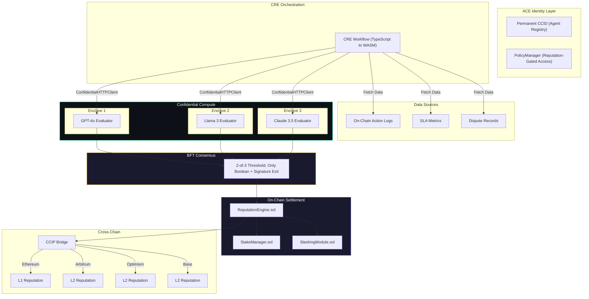
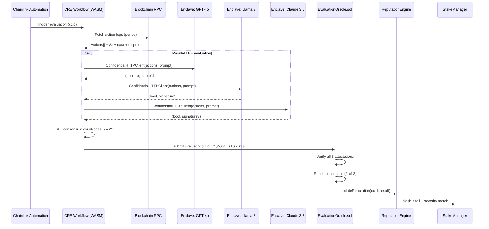
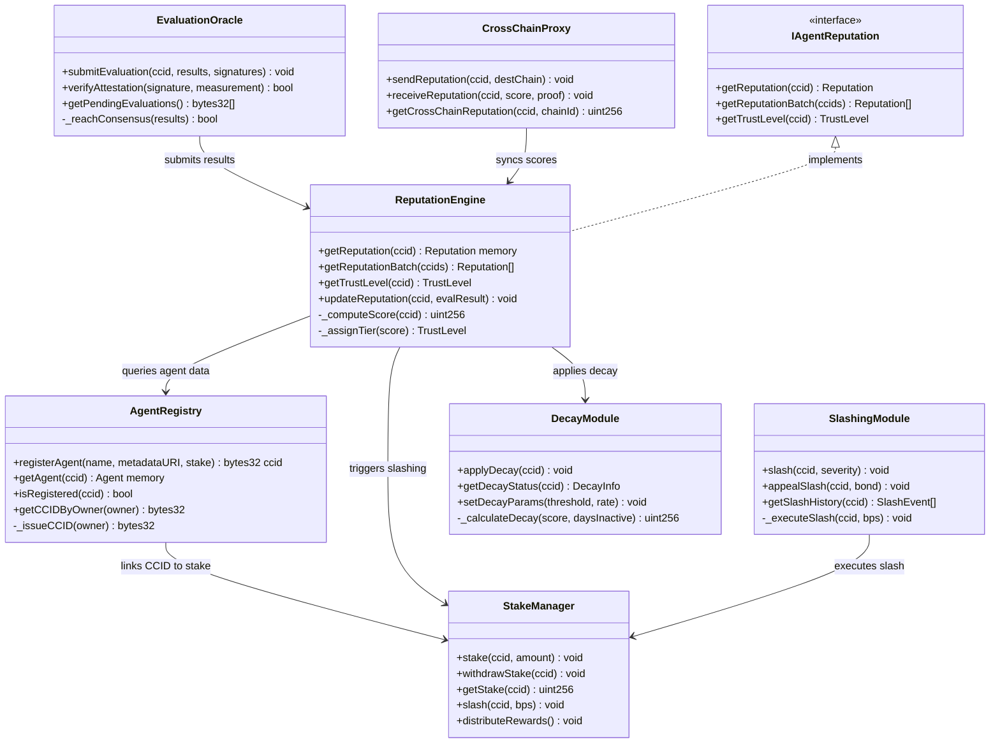
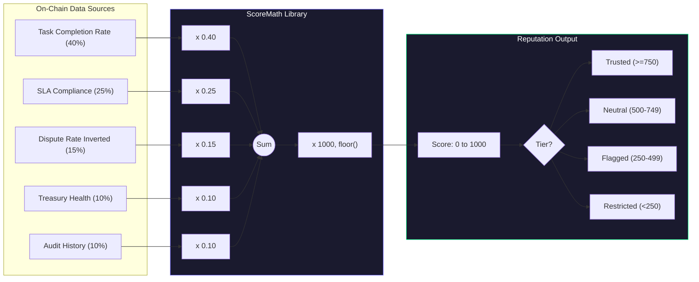

# Product Requirements Document — AI Agent Reputation Protocol

**Version**: 1.0.0  
**Status**: Active Development  
**Target Delivery**: 5–7 weeks (solo engineer)  
**Author**: Nous Research  
**Last Updated**: June 2026

---

## Table of Contents

1. [Executive Summary](#1-executive-summary)
2. [Problem Statement](#2-problem-statement)
3. [Solution Overview](#3-solution-overview)
4. [User Personas](#4-user-personas)
5. [Functional Requirements](#5-functional-requirements)
6. [Non-Functional Requirements](#6-non-functional-requirements)
7. [Smart Contract Architecture](#7-smart-contract-architecture)
8. [CRE Workflow Architecture](#8-cre-workflow-architecture)
9. [Scoring Algorithm Specification](#9-scoring-algorithm-specification)
10. [Risk Register](#10-risk-register)
11. [Testing Strategy](#11-testing-strategy)
12. [Deployment Strategy](#12-deployment-strategy)
13. [Glossary](#13-glossary)

---

## 1. Executive Summary

The autonomous AI agent economy has reached an inflection point. Over **18,000 AI agents** now operate on-chain across Ethereum, Solana, and L2 ecosystems, collectively generating an estimated **$479M in on-chain GDP** — a figure projected to exceed **$22.6B by 2030** (Messari, 2026). These agents execute trades, manage treasuries, govern DAOs, allocate liquidity, and negotiate counterparty agreements without human intervention.

Despite this explosive growth, **no production-grade trust infrastructure exists** for autonomous agents. Protocols integrate agents blindly. Users delegate capital without verifiable performance history. Marketplaces list agents with self-reported metrics. The result is a trust vacuum filled by ad-hoc, unaudited, and often manipulated reputation signals.

The **AI Agent Reputation Protocol** addresses this gap. It is an open, permissionless, Chainlink-native infrastructure layer that:

- Issues a **permanent, non-transferable CCID** (Cross-Chain Identifier) to every agent at registration via Chainlink ACE
- Continuously evaluates agent behavior using **BFT consensus of three independent AI models** (GPT-4o, Llama 3, Claude 3.5) executing inside **Confidential Compute TEE enclaves**
- Computes a **transparent, on-chain reputation score (0–1000)** from five weighted dimensions derived entirely from verifiable on-chain data
- Secures the system with **LINK staking and basis-point slashing** for malicious or negligent agent behavior
- Propagates reputation across all CCIP-supported chains, enabling agents to carry trust wherever they operate

The protocol was validated by the **Chainlink Convergence Hackathon winner AgentScore**, which demonstrated acute market demand for verifiable agent reputation. This PRD defines the specification, architecture, and requirements for turning that validation into production infrastructure.

---

## 2. Problem Statement

### 2.1 The Trust Deficit

Autonomous AI agents perform economically consequential actions on-chain: trading, lending, treasury rebalancing, and governance. Yet the ecosystem lacks:

| Problem | Impact |
|---------|--------|
| **No verifiable identity** | Agents can rebrand after poor performance; no persistent track record exists |
| **Self-reported metrics** | Agent builders report their own win rates, SLA compliance, and profitability — with no independent verification |
| **No dispute resolution** | When an agent fails or behaves maliciously, counterparties have no recourse and no record of the incident |
| **Fragmented reputation** | Reputation data is siloed per-protocol; an agent trusted on Protocol A must rebuild trust from zero on Protocol B |
| **No economic accountability** | Agents operate without skin in the game; there is no financial penalty for poor or malicious behavior |
| **Sybil vulnerability** | Without persistent identity, a single operator can spin up thousands of seemingly-independent agents, each with "clean" reputation |

### 2.2 Why Existing Solutions Fall Short

- **NFT-based identity** (e.g., ENS, Lens): Attestation without evaluation; an agent can hold an NFT and still behave maliciously.
- **Simple on-chain scores** (e.g., DappRadar-style metrics): Gameable with volume; no independent evaluation of behavior quality.
- **Centralized reputation APIs**: Single point of failure, opaque scoring, no cryptographic guarantees.
- **Manual auditing**: Unscalable for thousands of agents operating at machine speed.

### 2.3 Target Outcomes

By deploying this protocol, the ecosystem gains:

1. **Persistent agent identity** that cannot be shed, transferred, or re-rolled
2. **Consensus-based, privacy-preserving evaluation** of agent behavior by independent AI models
3. **A transparent, mathematical reputation formula** that any party can independently verify
4. **Economic security** via LINK staking and slashing, aligning agent incentives with honest behavior
5. **Cross-chain portability** so reputation travels with the agent across all major EVM networks

---

## 3. Solution Overview

### 3.1 High-Level Architecture

The protocol combines five Chainlink services into an integrated evaluation and reputation lifecycle:



### 3.2 Evaluation Lifecycle

The evaluation lifecycle runs continuously via Chainlink Automation:

1. **Trigger**: Chainlink Automation invokes the CRE workflow on a configurable schedule (default: every 24 hours for active agents) or on event (significant action detected).
2. **Data Collection**: The workflow fetches the agent's on-chain action logs, SLA telemetry, dispute records, and treasury status from the evaluation period.
3. **TEE Evaluation**: Each of the three AI evaluators receives the agent's action data via a `ConfidentialHTTPClient` call. The evaluator assesses whether the agent's behavior meets protocol-defined standards.
4. **Consensus**: The BFT consensus layer collects the three boolean results. If >=2 evaluators agree (pass or fail), consensus is reached.
5. **On-Chain Settlement**: The consensus result (boolean + cryptographic signatures from all three enclaves) is submitted to `ReputationEngine.sol`, which updates the agent's composite score.
6. **Slashing (if applicable)**: If the consensus result is `fail` and the failure meets a severity threshold, `SlashingModule.sol` slashes the agent's LINK stake by the appropriate basis-point amount.
7. **Cross-Chain Propagation**: Updated reputation data is relayed via CCIP to all registered destination chains.

### 3.3 Evaluation Sequence Diagram



---

## 4. User Personas

### 4.1 Agent Developer (Primary)

**Who**: A developer or team building autonomous AI agents — trading bots, treasury managers, governance delegates, or automated market makers.

**Goals**:
- Register their agent and receive a permanent, verifiable CCID
- Build reputation over time to unlock higher trust tiers and lower collateral requirements
- Prove their agent's reliability to potential users and protocol integrators
- Differentiate from malicious or low-quality agents

**Pain Points**:
- No existing mechanism to prove agent quality without self-reporting
- Hard to bootstrap trust for a new agent
- Competitors can impersonate or Sybil-attack reputation systems

**Key Interactions**: `registerAgent()`, `stake()`, `queryOwnReputation()`, `viewEvaluationHistory()`

### 4.2 DeFi Protocol Integrator

**Who**: A DeFi protocol (lending market, DEX, yield aggregator) that integrates AI agents as users or operators.

**Goals**:
- Risk-adjust parameters per agent based on verifiable reputation
- Require higher collateral from low-reputation agents
- Maintain an allowlist/blocklist driven by reputation tiers
- Reduce manual due diligence overhead

**Pain Points**:
- No standardized way to assess agent risk
- Agents can drain protocol value with no recourse
- Manual agent review does not scale

**Key Interactions**: `getReputation(ccid)`, `getTrustLevel(ccid)`, PolicyManager integration

### 4.3 Agent Marketplace Operator

**Who**: A platform that lists and matches AI agents with tasks or users (e.g., freelance agent marketplaces, compute markets).

**Goals**:
- Display verified reputation badges on agent profiles
- Gate listing tiers by reputation score
- Enable users to filter agents by trust level
- Monetize premium placement for high-reputation agents

**Pain Points**:
- Users demand proof of agent quality before engagement
- Reputation fraud (fake reviews, self-dealing) erodes marketplace trust
- No interoperable reputation standard across marketplaces

**Key Interactions**: `getReputation(ccid)`, `getReputationBatch(ccid[])`, `subscribeToReputationEvents()`

### 4.4 End User / Capital Allocator

**Who**: An individual or institution that delegates capital to AI agents for trading, yield generation, or treasury management.

**Goals**:
- Verify an agent's historical performance is real and independently assessed
- Understand the agent's risk profile before depositing funds
- Monitor agent reputation in real-time and set alerts on degradation

**Pain Points**:
- No way to distinguish between legitimate and fraudulent agents
- Historical performance claims are unverifiable
- No alerting when an agent's behavior degrades

**Key Interactions**: `getReputation(ccid)`, reputation event listeners, dashboard integrations

---

## 5. Functional Requirements

### 5.1 Agent Registration (FR-001 – FR-007)

| ID | Requirement | Priority | Verification |
|----|-------------|----------|--------------|
| **FR-001** | The system SHALL allow any EOA or contract to register as an AI agent, receiving a unique, permanent CCID via Chainlink ACE. | P0 | Unit test + integration test |
| **FR-002** | The system SHALL require a minimum LINK stake (configurable, default: 1,000 LINK) at registration, held in `StakeManager.sol`. | P0 | Unit test |
| **FR-003** | The system SHALL store agent metadata (name, description, metadata URI) immutably linked to the CCID. | P0 | Unit test |
| **FR-004** | The system SHALL NOT allow transfer, reassignment, or deletion of a CCID once issued (soulbound). | P0 | Invariant test |
| **FR-005** | The system SHALL emit `AgentRegistered(bytes32 indexed ccid, address indexed owner, uint256 stake, uint256 timestamp)` on registration. | P1 | Event assertion |
| **FR-006** | The system SHALL support registration fee payment in LINK, with a configurable fee parameter controlled by protocol governance. | P1 | Unit test |
| **FR-007** | The system SHALL reject registration if the agent's metadata URI does not return valid JSON with required fields (name, version). | P2 | Fuzz test |

### 5.2 Evaluation Triggering and Execution (FR-008 – FR-015)

| ID | Requirement | Priority | Verification |
|----|-------------|----------|--------------|
| **FR-008** | The system SHALL trigger agent evaluations on a configurable schedule via Chainlink Automation (default: every 24 hours for active agents). | P0 | Integration test |
| **FR-009** | The system SHALL trigger an immediate evaluation upon significant on-chain events (stake change >10%, dispute filed, large transaction). | P1 | Integration test |
| **FR-010** | The CRE evaluation workflow SHALL fetch the agent's complete on-chain action history for the evaluation period. | P0 | Workflow unit test |
| **FR-011** | The evaluation workflow SHALL invoke all three AI evaluators (GPT-4o, Llama 3, Claude 3.5) via `ConfidentialHTTPClient` within separate TEE enclaves. | P0 | Integration test |
| **FR-012** | Each AI evaluator SHALL return ONLY a boolean result (`true` = pass, `false` = fail) and a cryptographic signature proving execution in an authorized TEE enclave. | P0 | Enclave attestation verification |
| **FR-013** | No model weights, prompts, raw inference output, or intermediate data SHALL exit any TEE enclave under any condition. | P0 | Security audit |
| **FR-014** | The BFT consensus layer SHALL accept an evaluation result only when >=2 of 3 evaluators agree, with all three producing valid enclave attestations. | P0 | Unit test (mock enclaves) |
| **FR-015** | If any evaluator fails to respond or produces an invalid attestation, the system SHALL retry that evaluator up to 2 times before proceeding with the remaining evaluators (requiring 2-of-2 consensus). | P1 | Integration test |

### 5.3 Reputation Score Computation (FR-016 – FR-022)

| ID | Requirement | Priority | Verification |
|----|-------------|----------|--------------|
| **FR-016** | The `ReputationEngine.sol` SHALL compute the composite score as a weighted average: `S = 0.40*TCR + 0.25*SLA + 0.15*(1-DR) + 0.10*TH + 0.10*AH`, normalized to 0–1000. | P0 | Unit test with known inputs |
| **FR-017** | The system SHALL compute Task Completion Rate (TCR) as `completedTasks / totalTasks` over the evaluation window, sourced from on-chain event logs. | P0 | Unit test |
| **FR-018** | The system SHALL compute SLA Compliance (SLA) as the fraction of actions completed within their declared time/quality bounds. | P0 | Unit test |
| **FR-019** | The system SHALL compute Dispute Rate (DR) as `disputesUpheld / totalActions` and invert it in the formula (`1-DR`) so fewer disputes yields a higher score. | P0 | Unit test |
| **FR-020** | The system SHALL compute Treasury Health (TH) as `min(currentTreasury / initialTreasury, 1.0)`, capped at 1.0 to prevent score inflation. | P1 | Unit test |
| **FR-021** | The system SHALL compute Audit History (AH) as a binary factor: 1.0 if the agent has a passing audit within 180 days, 0.0 otherwise. | P2 | Unit test |
| **FR-022** | All score computation inputs SHALL be derived exclusively from on-chain data (event logs, storage proofs, or oracle-verified data) — never from off-chain sources. | P0 | Architecture review |

### 5.4 Slashing and Economic Security (FR-023 – FR-029)

| ID | Requirement | Priority | Verification |
|----|-------------|----------|--------------|
| **FR-023** | The `SlashingModule.sol` SHALL support three severity tiers, each with a configurable basis-point slash amount. | P0 | Unit test |
| **FR-024** | Minor infractions (e.g., single SLA miss) SHALL slash 500 bps (5%) of agent stake. | P1 | Unit test |
| **FR-025** | Moderate violations (e.g., repeated SLA misses, single dispute upheld) SHALL slash 2500 bps (25%) of agent stake. | P1 | Unit test |
| **FR-026** | Severe breaches (e.g., provable malicious behavior, multiple disputes upheld, theft) SHALL slash 10000 bps (100%) of agent stake AND permanently ban the CCID. | P0 | Unit test |
| **FR-027** | Slashed LINK SHALL be distributed: 70% to protocol treasury, 20% to affected counterparties (if identifiable), 10% burned. | P2 | Unit test |
| **FR-028** | Agents SHALL have a 48-hour challenge window after a slashing event to submit an on-chain appeal with additional bond (2x slash amount). | P2 | Unit test |
| **FR-029** | The protocol SHALL distribute staking rewards to honest agents pro-rata from protocol fee accumulation, configurable by governance. | P1 | Unit test |

### 5.5 Reputation Decay (FR-030 – FR-032)

| ID | Requirement | Priority | Verification |
|----|-------------|----------|--------------|
| **FR-030** | Agents inactive beyond a configurable threshold (default: 30 days) SHALL experience linear reputation decay at a configurable rate (default: 1% per day). | P1 | Unit test |
| **FR-031** | Decay SHALL be computed as `newScore = max(currentScore * (1 - daysInactive * decayRate), floorScore)`, where `floorScore = 100`. | P1 | Unit test |
| **FR-032** | The decay workflow SHALL execute via Chainlink Automation, checking inactivity status once per day. | P1 | Integration test |

### 5.6 Query Interface (FR-033 – FR-037)

| ID | Requirement | Priority | Verification |
|----|-------------|----------|--------------|
| **FR-033** | The system SHALL expose `getReputation(bytes32 ccid)` returning a `Reputation` struct: `{uint256 score, TrustLevel level, uint256 lastEvaluated, uint256 evaluationsCount}`. | P0 | Unit test |
| **FR-034** | The system SHALL expose `getReputationBatch(bytes32[] calldata ccids)` for gas-efficient bulk queries. | P1 | Gas test |
| **FR-035** | The system SHALL expose `getTrustLevel(bytes32 ccid)` returning an enum: `Trusted`, `Neutral`, `Flagged`, `Restricted`. | P0 | Unit test |
| **FR-036** | The system SHALL emit `ReputationUpdated(bytes32 indexed ccid, uint256 oldScore, uint256 newScore, TrustLevel oldLevel, TrustLevel newLevel)` on every score change. | P0 | Event assertion |
| **FR-037** | The `IAgentReputation` interface SHALL be minimal (<=8 functions) and require no off-chain dependencies for integration. | P0 | Design review |

---

## 6. Non-Functional Requirements

### 6.1 Security

| ID | Requirement | Target |
|----|-------------|--------|
| **NFR-001** | All smart contracts SHALL follow the Checks-Effects-Interactions (CEI) pattern. | Mandatory |
| **NFR-002** | All external/public functions SHALL use `ReentrancyGuardTransient` (OpenZeppelin 5.1+) for transient storage reentrancy protection. | Mandatory |
| **NFR-003** | The system SHALL use `AccessControl` (not `Ownable`) with granular roles: `DEFAULT_ADMIN_ROLE`, `EVALUATOR_ROLE`, `SLASHER_ROLE`, `GOVERNOR_ROLE`. | Mandatory |
| **NFR-004** | Admin actions (parameter changes, role grants, emergency pauses) SHALL route through a Safe multi-sig + `TimelockController` with minimum 48-hour delay. | Mandatory |
| **NFR-005** | All TEE enclave measurements SHALL be registered on-chain and verified before accepting any evaluation result. | Mandatory |
| **NFR-006** | The protocol SHALL protect against OWASP Smart Contract Top 10 (SC01–SC10), verified by Slither + Aderyn in CI. | Mandatory |
| **NFR-007** | A bug bounty SHALL be maintained on Immunefi with $50K+ critical reward. | Mandatory |

### 6.2 Performance

| ID | Requirement | Target |
|----|-------------|--------|
| **NFR-008** | `getReputation()` gas cost SHALL not exceed 30,000 gas (view function). | <=30K gas |
| **NFR-009** | `registerAgent()` gas cost SHALL not exceed 250,000 gas. | <=250K gas |
| **NFR-010** | Evaluation settlement transaction SHALL complete within 2 blocks of consensus. | <=2 blocks |
| **NFR-011** | Cross-chain reputation propagation via CCIP SHALL complete within 20 minutes under normal network conditions. | <=20 min |

### 6.3 Reliability and Availability

| ID | Requirement | Target |
|----|-------------|--------|
| **NFR-012** | The reputation query interface SHALL be available 100% of the time (pure on-chain; no off-chain dependency for reads). | 100% |
| **NFR-013** | The evaluation pipeline SHALL have >=99.5% uptime (Chainlink CRE + Automation SLA). | >=99.5% |
| **NFR-014** | The system SHALL gracefully degrade: if TEE evaluators are unavailable, evaluations SHALL queue for retry without blocking other protocol functions. | Required |

### 6.4 Upgradeability and Governance

| ID | Requirement | Target |
|----|-------------|--------|
| **NFR-015** | All core contracts SHALL use UUPS upgradeable proxy pattern (OpenZeppelin 5.1+). | Mandatory |
| **NFR-016** | Contract upgrades SHALL require multi-sig + TimelockController approval with >=48-hour delay. | Mandatory |
| **NFR-017** | Scoring formula parameters (weights, thresholds, decay rate) SHALL be configurable by governance without contract upgrade. | Mandatory |

### 6.5 Developer Experience

| ID | Requirement | Target |
|----|-------------|--------|
| **NFR-018** | All public/external functions SHALL have complete NatSpec documentation. | 100% coverage |
| **NFR-019** | The integration interface (`IAgentReputation`) SHALL be importable as a single file with no transitive dependencies. | 1 file |
| **NFR-020** | A TypeScript SDK SHALL be provided for off-chain reputation queries and event listening. | v0.1.0 |

---

## 7. Smart Contract Architecture

### 7.1 Contract Diagram



### 7.2 Contract Specifications

#### 7.2.1 `AgentRegistry.sol`

**Purpose**: The single source of truth for agent identity. Issues permanent CCIDs, stores metadata, and links agents to their stakes and reputation records.

**Key State Variables**:
- `mapping(bytes32 => Agent) private _agents` — CCID to Agent struct
- `mapping(address => bytes32) private _ownerToCCID` — Owner address to CCID
- `uint256 public constant MIN_STAKE = 1000 * 1e18` — 1,000 LINK in wei

**Access Control**: `DEFAULT_ADMIN_ROLE` for parameter changes; permissionless `registerAgent()`.

**Events**: `AgentRegistered`, `MetadataUpdated`, `AgentDeactivated`

#### 7.2.2 `ReputationEngine.sol`

**Purpose**: Computes and stores reputation scores. The primary integration point for external protocols. All score math lives in the `ScoreMath` library.

**Key Functions**:
- `updateReputation(bytes32 ccid, EvalResult calldata result)` — Called by `EvaluationOracle` only (`EVALUATOR_ROLE`). Recomputes the composite score.
- `getReputation(bytes32 ccid)` — Public view. Returns the full `Reputation` struct.
- `getReputationBatch(bytes32[] calldata ccids)` — Gas-optimized bulk query.

**Score Tiers** (configurable via governance):
- `TRUSTED_THRESHOLD = 750`
- `NEUTRAL_THRESHOLD = 500`
- `FLAGGED_THRESHOLD = 250`

#### 7.2.3 `StakeManager.sol`

**Purpose**: Holds LINK stakes, processes slashing, and distributes rewards. Integrates with Chainlink LINK token (ERC-677).

**Key Functions**:
- `stake(bytes32 ccid, uint256 amount)` — Locks LINK. Must be called during registration.
- `withdrawStake(bytes32 ccid)` — Releases stake if agent has no pending disputes and passes cooldown.
- `slash(bytes32 ccid, uint256 bps)` — Called by `SlashingModule` only.

**Staking Rewards**: Distributed pro-rata from accumulated protocol fees. Rewards rate and distribution schedule set by governance.

#### 7.2.4 `SlashingModule.sol`

**Purpose**: Executes stake slashing at configurable severity levels. Maintains immutable slash history for each CCID.

**Severity Tiers** (basis points):

| Severity | BPS | Percentage | Trigger |
|----------|-----|------------|---------|
| `MINOR` | 500 | 5% | Single SLA miss, late response |
| `MODERATE` | 2500 | 25% | Repeated SLA misses, single dispute upheld |
| `SEVERE` | 10000 | 100% | Provable malicious behavior, theft, multiple disputes |

**Ban Mechanism**: Severe slash permanently sets `agent.banned = true` in `AgentRegistry`. Banned CCIDs cannot participate in any protocol functions.

#### 7.2.5 `EvaluationOracle.sol`

**Purpose**: The on-chain endpoint for CRE workflows to submit evaluation results. Verifies TEE attestations before accepting any result. Enforces the BFT consensus rule (2-of-3).

**Attestation Verification Process**:
1. Receive `(ccid, results[3], signatures[3])` from CRE workflow
2. For each result: verify the signature against the registered enclave measurement
3. Count `pass` and `fail` results from verified evaluators
4. If >=2 agree, call `ReputationEngine.updateReputation()` with the consensus result
5. If <2 agree or attestations fail, emit `EvaluationInconclusive` and queue retry

#### 7.2.6 `DecayModule.sol`

**Purpose**: Manages time-based reputation decay for inactive agents. Triggered by Chainlink Automation.

**Decay Formula**:
```
decayedScore = max(currentScore * (1 - min(daysInactive - threshold, 0) * decayRate), 100)
```
Where defaults are: `threshold = 30 days`, `decayRate = 0.01` (1%).

#### 7.2.7 `CrossChainProxy.sol`

**Purpose**: Sends and receives reputation data across chains via CCIP. Each chain deploys its own instance of the protocol; the proxy synchronizes scores.

**Sender Flow**:
1. On score update, `ReputationEngine` calls `CrossChainProxy.sendReputation(ccid, destChainSelector)`
2. Proxy encodes the reputation payload and calls CCIP Router
3. CCIP delivers the payload to the destination chain's `CrossChainProxy.receiveReputation()`

---

## 8. CRE Workflow Architecture

### 8.1 Evaluation Workflow

The primary CRE workflow orchestrates the end-to-end evaluation lifecycle. Written in TypeScript and compiled to WASM, it executes deterministically within the Chainlink Runtime Environment.

**Key Workflow Operations**:

1. **Data Aggregation**: Fetches agent action logs via standard RPC calls, filters by evaluation period, and computes raw metrics (tasks completed, SLA stats, dispute counts)
2. **TEE Dispatch**: Invokes three `ConfidentialHTTPClient` calls in parallel to the GPT-4o, Llama 3, and Claude 3.5 evaluator endpoints
3. **Consensus Formation**: Counts pass/fail from all three evaluators; requires >=2 agreement
4. **On-Chain Submission**: Constructs and sends the `submitEvaluation` transaction to `EvaluationOracle.sol`

**Edge Cases Handled**:
- Evaluator timeout: 30-second per-evaluator timeout with up to 2 retries
- Partial evaluator failure: If one evaluator fails after retries, proceed with 2-of-2 consensus
- Total evaluator failure: Queue evaluation for retry, log error, do not submit
- Chain reorg protection: Wait 6 block confirmations before submitting

### 8.2 Decay Workflow

A lightweight CRE workflow triggered daily by Chainlink Automation:

1. Query all active CCIDs from `AgentRegistry`
2. For each: fetch `lastActionTimestamp`
3. If `now - lastActionTimestamp > decayThreshold` (30 days):
   - Compute `daysInactive = (now - lastActionTimestamp - decayThreshold) / 86400`
   - Call `DecayModule.applyDecay(ccid)` on-chain
4. Batch agents into manageable groups (max 50 per transaction) for gas efficiency

### 8.3 SLA Monitoring Workflow

Continuous monitoring of agent SLA compliance:

1. Agent declares SLA parameters at registration (e.g., "executes trades within 30 seconds")
2. CRE workflow monitors each agent action, measuring `actualCompletionTime - expectedCompletionTime`
3. SLA violations are recorded on-chain via `EvaluationOracle` as a "late" flag
4. Accumulated SLA violations feed into the composite score (SLA component)

### 8.4 Workflow Implementation Reference

```typescript
// workflows/evaluation.ts (simplified reference)
import { ConfidentialHTTPClient, runtime } from "@chainlink/cre";
import { bigint } from "@chainlink/cre/math";

interface EvalResult {
  passed: boolean;
  signature: string;
}

export async function evaluateAgent(ccid: string): Promise<void> {
  const evaluationWindow = runtime.now() - bigint(86400); // 24 hours

  // Fetch agent action data from on-chain
  const actions = await fetchAgentActions(ccid, evaluationWindow);

  // Parallel TEE evaluation by three independent models
  const [r1, r2, r3]: EvalResult[] = await Promise.all([
    evaluateWithGPT4o(actions),
    evaluateWithLlama3(actions),
    evaluateWithClaude(actions),
  ]);

  // BFT consensus: require 2-of-3 agreement
  const passCount = [r1, r2, r3].filter(r => r.passed).length;
  const consensus = passCount >= 2;

  // Submit to on-chain EvaluationOracle
  await submitToOracle(ccid, [r1, r2, r3], consensus);

  // Log for observability
  runtime.log(`Agent ${ccid}: ${passCount}/3 passed, consensus=${consensus}`);
}
```

---

## 9. Scoring Algorithm Specification

### 9.1 Composite Score Formula

```
S = floor(1000 * (0.40 * TCR + 0.25 * SLA + 0.15 * (1 - DR) + 0.10 * TH + 0.10 * AH))
```

Where each component is in the range [0.0, 1.0]:

### 9.2 Component Definitions

#### 9.2.1 Task Completion Rate (TCR) — Weight: 0.40

```
TCR = completedTasks / max(totalTasks, 1)
```

- `completedTasks`: Count of tasks where the agent produced a valid, accepted output
- `totalTasks`: Count of all tasks assigned to the agent in the evaluation window
- Window: Rolling 30 days
- Source: On-chain event logs (`TaskCompleted`, `TaskAssigned`)

#### 9.2.2 SLA Compliance (SLA) — Weight: 0.25

```
SLA = slaCompliantActions / max(totalTrackedActions, 1)
```

- `slaCompliantActions`: Actions completed within declared SLA bounds
- `totalTrackedActions`: All actions with SLA declarations
- Window: Rolling 30 days
- Source: On-chain event logs + SLA declaration at registration

#### 9.2.3 Dispute Rate Inverted (DR) — Weight: 0.15

```
DR_Component = max(1 - (disputesUpheld / max(totalActions, 1)), 0)
```

- `disputesUpheld`: Disputes resolved in favor of the complainant
- `totalActions`: Total actions performed by the agent
- Floor: 0.0 (if too many disputes, this component contributes 0)
- Source: `DisputeResolved` events from the dispute resolution module

#### 9.2.4 Treasury Health (TH) — Weight: 0.10

```
TH = min(currentTreasuryBalance / max(initialTreasuryBalance, 1), 1.0)
```

- Cap: 1.0 — treasury growth beyond initial balance does not inflate score
- Metric: Ratio of current operating treasury to the initial balance at registration
- Source: On-chain balance of agent's registered treasury address

#### 9.2.5 Audit History (AH) — Weight: 0.10

```
AH = { 1.0  if lastAuditPassed && (now - lastAuditTimestamp) < 180 days
     { 0.0  otherwise
```

- Binary factor: either 1.0 or 0.0
- Audit validity window: 180 days
- Source: `AuditCompleted` event with `passed = true`

### 9.3 Threshold Mapping

```
TrustLevel = {
    Trusted    if score >= 750
    Neutral    if score >= 500 AND score < 750
    Flagged    if score >= 250 AND score < 500
    Restricted if score < 250
}
```

### 9.4 Scoring Flow Diagram



### 9.5 Example Calculations

**Example 1: High-Performing Agent**
- TCR = 0.95, SLA = 0.92, DR = 0.02, TH = 1.0, AH = 1.0
- `S = floor(1000 * (0.40*0.95 + 0.25*0.92 + 0.15*0.98 + 0.10*1.0 + 0.10*1.0))`
- `S = floor(1000 * (0.38 + 0.23 + 0.147 + 0.10 + 0.10))`
- `S = floor(1000 * 0.957) = 957` — **Trusted**

**Example 2: Struggling Agent**
- TCR = 0.60, SLA = 0.45, DR = 0.30, TH = 0.50, AH = 0.0
- `S = floor(1000 * (0.40*0.60 + 0.25*0.45 + 0.15*0.70 + 0.10*0.50 + 0.10*0.0))`
- `S = floor(1000 * (0.24 + 0.1125 + 0.105 + 0.05 + 0.0))`
- `S = floor(1000 * 0.5075) = 507` — **Neutral**

**Example 3: Malicious Agent**
- TCR = 0.10, SLA = 0.05, DR = 0.80, TH = 0.10, AH = 0.0
- `S = floor(1000 * (0.40*0.10 + 0.25*0.05 + 0.15*0.20 + 0.10*0.10 + 0.10*0.0))`
- `S = floor(1000 * (0.04 + 0.0125 + 0.03 + 0.01 + 0.0))`
- `S = floor(1000 * 0.0925) = 92` — **Restricted**

---

## 10. Risk Register

| ID | Risk | Likelihood | Impact | Mitigation |
|----|------|-----------|--------|------------|
| **R-001** | **Sybil attacks**: Single operator registers thousands of agents to game reputation | Medium | High | CCID issuance requires LINK stake (economic cost per agent); minimum stake set high enough to make mass registration uneconomical; stake slashing punishes coordinated malicious behavior |
| **R-002** | **Evaluator model gaming**: Adversary reverse-engineers evaluation criteria and trains agents to pass without genuine quality | Medium | High | Evaluation prompt is rotated periodically; models run in TEE enclaves so prompts cannot be extracted; BFT consensus requires compromising 2-of-3 models simultaneously; CRE workflows can incorporate adversarial examples |
| **R-003** | **TEE unavailability**: All three TEE enclaves become unavailable simultaneously | Low | High | EvaluationOracle queues evaluations for retry; no liveness dependency — query interface works without TEEs; emergency governance can authorize fallback evaluator set |
| **R-004** | **Single evaluator compromise**: One AI model is compromised or produces biased results | Medium | Low | BFT consensus requires 2-of-3 agreement; single compromised evaluator cannot alter outcomes; attestation verification prevents unauthorized compute from submitting results |
| **R-005** | **Oracle manipulation**: CRE workflow is fed manipulated on-chain data | Low | Critical | All data sources are on-chain event logs; no off-chain data enters the scoring pipeline; data integrity is guaranteed by chain consensus |
| **R-006** | **Stake draining attack**: Exploit in `StakeManager.sol` allows unauthorized withdrawal | Low | Critical | ReentrancyGuardTransient on all stake operations; CEI pattern; TimelockController on parameter changes; >=90% test coverage; Slither + Aderyn in CI; Immunefi bounty |
| **R-007** | **Score inflation via treasury manipulation**: Agent artificially inflates treasury balance to boost TH component | Medium | Medium | TH component capped at 1.0; treasury address must be registered and is immutable; sudden large deposits flagged for review |
| **R-008** | **Cross-chain replay / double-spend**: Attacker replays a CCIP reputation message to claim reputation on multiple chains | Low | High | CCIP provides native replay protection via sequence numbers; `CrossChainProxy` maintains a `mapping(bytes32 => uint256) nonce` per message; destination contract validates nonce before accepting |
| **R-009** | **Governance key compromise**: Multi-sig keys are compromised | Low | Critical | Safe multi-sig requires M-of-N signatures; TimelockController enforces 48-hour delay on all admin actions; emergency pause role is separate and can freeze protocol during incident response |
| **R-010** | **Reputation decay exploits**: Agent performs minimum actions just before decay threshold to reset timer | Low | Low | Decay considers rolling window of activity quality, not just presence; minimum action quality threshold required to reset decay timer |
| **R-011** | **Economic attack on evaluators**: Adversary bribes or threatens AI model operators to produce favorable evaluations | Very Low | High | Models run in TEE enclaves — operators cannot observe or modify evaluations; cryptographic attestation binds results to specific enclave measurements; rotating evaluator set via governance |
| **R-012** | **CCIP bridge downtime**: Cross-chain reputation propagation stalls | Medium | Medium | Each chain maintains independent reputation state; CCIP has its own redundancy and retry mechanisms; scores are eventually consistent, not real-time dependent on bridge |

---

## 11. Testing Strategy

### 11.1 Testing Layers

```
+----------------------------------------+
|        Integration Tests               |
|   (CRE workflows + contracts)          |
+----------------------------------------+
|        Invariant Tests                  |
|   (Foundry invariants, Echidna)        |
+----------------------------------------+
|        Fuzz Tests                      |
|   (Foundry fuzz, 10K+ runs)            |
+----------------------------------------+
|        Unit Tests                      |
|   (Foundry forge test)                 |
+----------------------------------------+
```

### 11.2 Coverage Requirements

| Layer | Target | Tool |
|-------|--------|------|
| Line coverage | >=90% | `forge coverage` |
| Branch coverage | >=85% | `forge coverage` |
| Function coverage | 100% | `forge coverage` |
| Fuzz runs per test | >=10,000 | `forge test --fuzz-runs 10000` |
| Invariant tests | >=10 per contract | Foundry invariants + Echidna |
| Integration scenarios | >=15 end-to-end | Custom test harness |

### 11.3 Test Categories

#### Unit Tests (Priority: P0)
- Every public/external function tested with valid inputs, edge cases, and revert conditions
- `ScoreMath` library tested with the example calculations from Section 9.5
- `BasisPoints` library tested for overflow/underflow safety
- Access control: every role-gated function tested for unauthorized access attempts

#### Fuzz Tests (Priority: P0)
- `registerAgent()`: Fuzz metadata URI, name length, stake amount
- `updateReputation()`: Fuzz all five score components across full [0.0, 1.0] range
- `slash()`: Fuzz BPS amounts and verify correct LINK transfer amounts
- `applyDecay()`: Fuzz days inactive from 0 to 365

#### Invariant Tests (Priority: P0)
- No CCID can be transferred or reassigned after issuance
- Composite score always in [0, 1000]
- Sum of all stakes in `StakeManager` = sum of individual agent stakes (no LINK leakage)
- Slashed LINK total matches BPS computation within 1 wei tolerance
- Trust tier thresholds strictly partition the score space

#### Integration Tests (Priority: P1)
- Full registration -> evaluation -> score update -> query lifecycle
- Multi-agent scenario: 50 agents registered, batch evaluation, verify all scores
- Slashing flow: fail evaluation -> slash -> verify LINK distribution
- Decay flow: agent inactive 35 days -> apply decay -> verify score reduction
- Cross-chain: send reputation via mock CCIP -> verify receipt on destination
- CRE workflow: mock TEE responses -> verify consensus logic in WASM

### 11.4 CI Pipeline

```
PR Open -> forge build -> forge test -> forge coverage (>=90%)
    -> slither . -> aderyn . -> gas snapshot diff
    -> (all must pass before merge)
```

---

## 12. Deployment Strategy

### 12.1 Network Rollout

| Phase | Network | Purpose | Timeline |
|-------|---------|---------|----------|
| **Phase 1** | Sepolia Testnet | Initial deployment, integration testing, early adopter onboarding | Week 5 |
| **Phase 2** | Arbitrum Sepolia + Base Sepolia | Cross-chain CCIP testing | Week 6 |
| **Phase 3** | Ethereum Mainnet | Production launch with full audit | Week 7+ (post-audit) |
| **Phase 4** | Arbitrum One, Optimism, Base, Polygon | Multi-chain expansion | Week 8+ |

### 12.2 Deployment Procedure

1. **Pre-Deployment**:
   - Third-party security audit completed (code + CRE workflows)
   - Immunefi bug bounty launched ($50K+ critical)
   - All NatSpec documentation verified
   - Governance multi-sig (Safe) deployed and configured
   - `TimelockController` deployed with 48-hour minimum delay

2. **Deployment Script**:
   - Foundry script (`script/Deploy.s.sol`) deploys all contracts in dependency order
   - UUPS proxy pattern: implementation -> proxy -> initialize
   - TEE enclave measurements registered in `EvaluationOracle`
   - Initial scoring parameters set via governance

3. **Post-Deployment Verification**:
   - Contract verification on Etherscan/Blockscout
   - `forge script` dry-run matches actual deployment
   - All roles assigned to correct addresses
   - CCIP lane configuration verified
   - Automation upkeep registered for evaluation and decay workflows

### 12.3 Upgrade Procedure

1. Propose upgrade via governance (multi-sig)
2. TimelockController enforces 48-hour delay
3. Deploy new implementation contract
4. Call `UUPSUpgradeable.upgradeTo(newImplementation)`
5. Verify storage layout compatibility (no collisions)
6. Run full test suite against upgraded contracts
7. Monitor for 24 hours before considering upgrade stable

### 12.4 Emergency Response

- **Emergency Pause**: `GOVERNOR_ROLE` can call `pause()` on the protocol, freezing all state-mutating functions (read queries remain available)
- **Evaluator Rotate**: If a TEE evaluator is suspected compromised, `EVALUATOR_ROLE` can rotate the enclave measurement set
- **Parameter Freeze**: In extreme scenarios, governance can freeze scoring parameters to prevent manipulation during incident response

---

## 13. Glossary

| Term | Definition |
|------|------------|
| **ACE** | Agent Communication Environment — Chainlink's framework for agent identity and access control |
| **BFT** | Byzantine Fault Tolerance — consensus mechanism tolerating up to f faulty nodes with 3f+1 total |
| **BPS** | Basis Points — 1/100th of a percentage point (100 bps = 1%) |
| **CCID** | Cross-Chain Identifier — permanent, non-transferable identity issued to agents via ACE |
| **CCIP** | Cross-Chain Interoperability Protocol — Chainlink's secure cross-chain messaging protocol |
| **CEI** | Checks-Effects-Interactions — Solidity security pattern preventing reentrancy |
| **CRE** | Chainlink Runtime Environment — platform for building and executing oracle workflows |
| **TEE** | Trusted Execution Environment — hardware-enforced isolated compute (Intel SGX, AMD SEV, AWS Nitro) |
| **UUPS** | Universal Upgradeable Proxy Standard — OpenZeppelin proxy pattern where upgrade logic lives in implementation |
| **WASM** | WebAssembly — compilation target for CRE workflows (TypeScript to WASM) |

---

*Document version 1.0.0. All requirements subject to refinement during development. Breaking changes to the scoring formula or contract interfaces will be proposed via governance and require TimelockController delay.*
