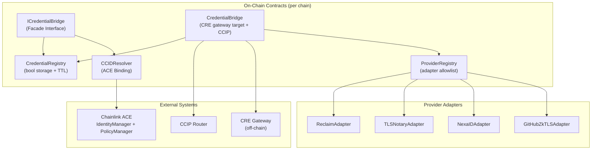
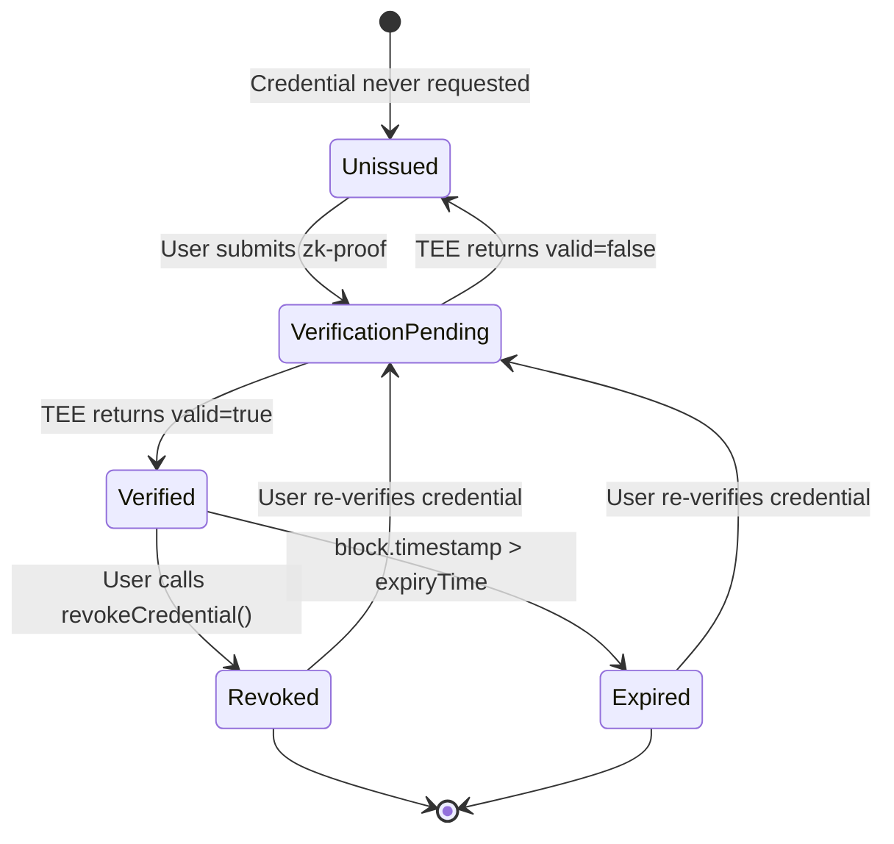
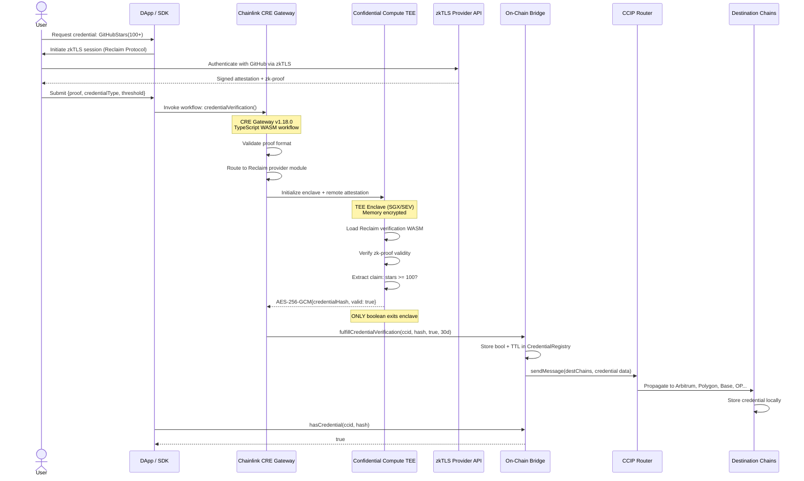
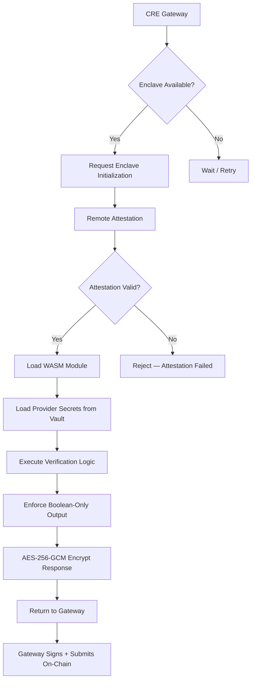
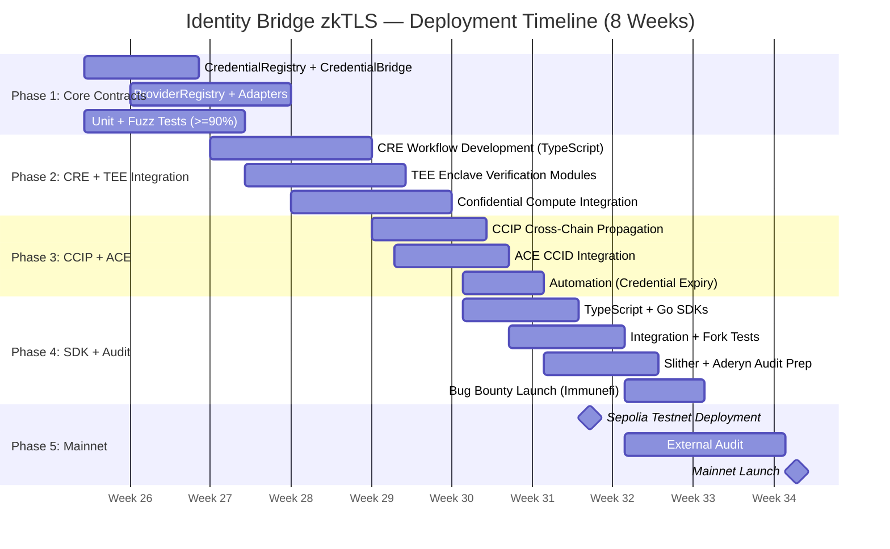

# Product Requirements Document (PRD)

## Identity Bridge zkTLS — Cross-Chain Privacy-Preserving Credential Bridge

| Field | Value |
|-------|-------|
| **Document Version** | 1.0.0 |
| **Status** | Active Development |
| **Last Updated** | 2026-06-17 |
| **Author** | Nous Research |
| **Target Launch** | Q3 2026 (8-week solo build) |
| **License** | MIT |

## 1. Executive Summary

Identity Bridge zkTLS is a **Chainlink-native, cross-chain credential bridge** that converts web2 identity attributes into privacy-preserving, on-chain verifiable credentials. Users prove attributes from any web2 data source — GitHub stars, KYC status, employment verification, academic credentials — through zkTLS (zero-knowledge Transport Layer Security) proofs. All verification executes inside **Chainlink Confidential Compute TEE enclaves**, ensuring that only a boolean result (valid/invalid) exits the enclave. Raw identity data never touches a public blockchain or off-chain database.

Credentials are bound to a **Cross-Chain Identity (CCID)** issued by Chainlink ACE, making them portable across all CCIP-connected chains. A smart contract asks one question: "Does CCID `0xabc...` hold credential `GitHubStars(100+)`?" and gets a boolean answer — nothing more.

The system is designed for an **8-week solo build** leveraging Chainlink's managed infrastructure (CRE, CCIP, ACE, Confidential Compute, Automation) to minimize custom infrastructure and maximize composability with the existing Chainlink ecosystem.

### Core Value Proposition

For **DeFi lending protocols**, Identity Bridge enables undercollateralized lending by cryptographically proving borrower identity and reputation without exposing sensitive data to the public ledger — satisfying both risk management and privacy compliance (GDPR, CCPA).

For **RWA (Real World Asset) protocols**, Identity Bridge provides the identity layer for compliance checks (KYC/AML, accredited investor status, sanctions screening) while keeping raw identity data off-chain, addressing the fundamental tension between regulatory compliance and blockchain transparency.


## 2. Problem Statement

### 2.1 Market Context

The web2 identity verification market is valued at **$490M+** (2026 estimate) and encompasses **300+ data providers** across KYC/KYB, employment verification, academic credentials, social reputation, and professional licensing. Meanwhile, DeFi protocols are increasingly seeking identity solutions for:

- **Undercollateralized lending**: Proven on-chain in 2024-2025 via protocols like Maple Finance, TrueFi, and Clearpool, but requiring KYC providers that leak PII onto public ledgers
- **RWA compliance**: Tokenized real-world assets require investor accreditation, KYC/AML, and sanctions screening per SEC, FINRA, and EU MiCA regulations
- **Sybil resistance**: Airdrop farming and governance attacks demonstrate the need for unique-human verification without government-issued ID collection

### 2.2 The zkTLS Fragmentation Problem

zkTLS technology (Reclaim Protocol, TLSNotary, NexaID, github-zktls, and emerging providers) cryptographically solves the problem of proving web2 data without revealing it. However, the ecosystem is deeply fragmented:

1. **Provider-specific SDKs**: Each zkTLS provider has its own TypeScript/JavaScript SDK, its own proof format, and its own verification logic. Integrating multiple providers requires duplicating integration effort.

2. **No unified on-chain interface**: Every protocol that wants zkTLS identity must deploy its own verification contracts, manage its own oracle infrastructure, and handle its own cross-chain propagation.

3. **No credential portability**: A credential verified for Protocol A on Ethereum cannot be used by Protocol B on Arbitrum. Users must re-verify the same web2 data for every protocol on every chain.

4. **Privacy leakage in verification**: Most current zkTLS integrations run verification logic in plaintext off-chain environments (DON nodes, cloud functions), exposing raw identity data to node operators.

5. **No credential lifecycle management**: Credentials have no standard expiry, renewal, or revocation mechanism. A KYC verification from 2023 is treated identically to one from today.

### 2.3 Regulatory Pressure

GDPR Article 17 (Right to Erasure) creates tension with immutable on-chain data. The EU Data Protection Board's 2025 guidance on blockchain and personal data explicitly states that on-chain storage of personal data — even hashed — may violate GDPR if the data is re-identifiable. Identity Bridge addresses this by ensuring no personal data is stored on-chain (only boolean credentials) and by supporting credential expiry as a form of "automated erasure."


## 3. Solution Overview

Identity Bridge zkTLS provides a **unified, Chainlink-orchestrated** credential bridge with four architectural pillars:

### 3.1 Pluggable zkTLS Provider Adapters

A standardized `IZkTLSProvider` Solidity interface plus corresponding CRE workflow modules enable any zkTLS provider to be integrated as a plugin. New providers are added by deploying an adapter contract and a CRE workflow module — no changes to core contracts.

### 3.2 TEE-Backed Privacy Guarantee

All zk-proof verification executes inside a **Chainlink Confidential Compute TEE enclave** (Intel SGX / AMD SEV). The enclave receives:
- The zk-proof from the user's chosen provider
- The credential type and threshold (e.g., `GitHubStars`, `100`)
- Provider-specific verification parameters via Vault DON secrets

The enclave outputs **only**:
```json
{
  "credentialHash": "0xabc...",
  "valid": true
}
```

The response is encrypted with **AES-256-GCM**. No raw identity data, no PII, no intermediate attestation contents exit the enclave at any point.

### 3.3 CCID-Bound Universal Identity

Credentials are bound to a **Chainlink ACE CCID** (Cross-Chain Identity), not to wallet addresses. This provides:
- One identity across all chains
- Credential portability without re-verification
- ACE `PolicyManager` integration for credential-gated access control
- CCID recovery and revocation through ACE `IdentityManager`

### 3.4 CCIP Cross-Chain Propagation

When a credential is verified, CCIP broadcasts the boolean result to `CredentialRegistry` contracts on every supported chain. Reads are local (zero cross-chain latency), and CCIP ensures eventual consistency across chains. Rate limiting per destination chain prevents DoS attacks.


## 4. User Personas

### 4.1 Institutional DeFi Lenders (Primary)

**Profile**: Credit funds, real-world asset protocols, and institutional lending desks transitioning on-chain (Maple Finance, Centrifuge, Goldfinch).

**Pain Points**:
- Need KYC/AML compliance but cannot store PII on public ledgers
- Require accredited investor verification per SEC Rule 506(c)
- Must satisfy GDPR right-to-erasure for EU borrowers
- Audit trail must satisfy traditional finance regulators

**Use Case**: A credit fund deploys a lending pool on Ethereum. Borrowers must prove KYC at a regulated exchange (Binance, Coinbase) and minimum GitHub activity (100+ stars) for developer credit scoring. The lending contract calls `ICredentialBridge.hasCredential(ccid, keccak256("KYC(Binance)"))` and `hasCredential(ccid, keccak256("GitHubStars(100+)"))` — both return booleans without exposing any identity data.

### 4.2 DAOs and Governance Protocols

**Profile**: DAOs seeking sybil-resistant governance, one-person-one-vote systems, and quadratic voting mechanisms.

**Pain Points**:
- Token-weighted voting enables whale domination
- Sybil attacks on airdrops and governance proposals
- No privacy-preserving way to prove unique humanity

**Use Case**: A DAO requires voters to prove employment at any Fortune 500 company (without revealing which one) to participate in enterprise-focused governance. The governance contract gates voting on `hasCredential(ccid, keccak256("Employment(Fortune500)"))`.

### 4.3 dApp Developers (Secondary)

**Profile**: Full-stack Web3 developers building applications that need identity verification.

**Pain Points**:
- zkTLS integration requires learning provider-specific SDKs
- No unified TypeScript/Go SDK for multi-provider identity
- Cross-chain credential queries require custom infrastructure
- On-chain KYC providers are expensive ($1-5 per verification) and leak PII

**Use Case**: A developer building a peer-to-peer marketplace uses the Identity Bridge SDK to require seller verification (KYC + employment) in under 50 lines of code. The SDK handles provider routing, proof submission, and credential querying.

---

## 5. Functional Requirements

### FR-001: Credential Verification Request

**Priority**: P0 (Must Have)
**Description**: Users MUST be able to submit a zkTLS proof to the system and receive an on-chain boolean credential.

**Acceptance Criteria**:
- User generates zk-proof from any supported provider (Reclaim, TLSNotary, NexaID, github-zktls)
- User submits proof to CRE gateway with credential type and threshold parameters
- CRE routes proof to TEE enclave based on provider type
- TEE verifies proof, evaluates threshold condition, outputs boolean-only result
- On-chain `CredentialRegistry` stores `true` with TTL block timestamp
- Event `CredentialVerified(bytes32 indexed ccid, bytes32 indexed credentialHash, uint256 expiryBlock)` emitted

### FR-002: Credential Query Interface

**Priority**: P0 (Must Have)
**Description**: Smart contracts MUST be able to query credential status via a standard interface.

**Acceptance Criteria**:
- `ICredentialBridge.hasCredential(bytes32 ccid, bytes32 credentialHash) returns (bool)` available on all supported chains
- Query returns `false` if credential never issued, expired, or explicitly revoked
- Query is a `view` function — zero gas cost for reads from other contracts
- Query latency is local (no cross-chain call needed)

### FR-003: CCID Integration

**Priority**: P0 (Must Have)
**Description**: Credentials MUST be bound to Chainlink ACE CCIDs.

**Acceptance Criteria**:
- System integrates with ACE `IdentityManager` for CCID resolution
- `getCCID(address user) returns (bytes32)` maps wallet addresses to CCIDs
- One CCID can hold multiple credentials of different types
- CCID-to-credential binding is immutable (credential cannot transfer between CCIDs)
- ACE `PolicyManager` supports `CREDENTIAL_GATE` policy type for credential-gated access

### FR-004: Cross-Chain Credential Propagation

**Priority**: P0 (Must Have)
**Description**: Verified credentials MUST propagate to all supported chains via CCIP.

**Acceptance Criteria**:
- After on-chain verification on origin chain, CCIP message broadcasts credential to all destination chains
- `allowOutOfOrderExecution=true` for eventual consistency model
- Each destination chain's `CredentialRegistry` receives and stores the credential
- CCIP messages include `msg.sender == ccipRouter` verification on destination
- Rate limiting enforced per destination chain (configurable via `TimelockController`)

### FR-005: Pluggable Provider Architecture

**Priority**: P0 (Must Have)
**Description**: The system MUST support adding new zkTLS providers without modifying core contracts.

**Acceptance Criteria**:
- `IZkTLSProvider` interface is provider-agnostic
- New adapter contracts can be deployed and registered via `ProviderRegistry`
- CRE workflow supports provider routing based on proof metadata
- TEE enclave loads provider-specific verification WASM modules dynamically
- Adding a provider does not require contract upgrade (UUPS immutable after provider addition)

### FR-006: Credential TTL and Auto-Expiry

**Priority**: P1 (Must Have)
**Description**: Credentials MUST have configurable time-to-live with automatic expiry.

**Acceptance Criteria**:
- Each credential type has a default TTL stored in `CredentialRegistry`
- TTL is enforced on every `hasCredential` query: `block.timestamp > expiryTime → returns false`
- Chainlink Automation monitors credential expiry and triggers renewal workflows
- Expired credentials emit `CredentialExpired(bytes32 indexed ccid, bytes32 indexed credentialHash)`
- TTL is configurable per credential type via `TimelockController` governance

### FR-007: Developer SDK (TypeScript + Go)

**Priority**: P1 (Must Have)
**Description**: Developers MUST be able to integrate Identity Bridge in under 100 lines of code.

**Acceptance Criteria**:
- TypeScript SDK published to npm as `@identity-bridge/sdk`
- Go SDK published as `github.com/nousresearch/identity-bridge-sdk`
- SDK provides: `requestCredential()`, `hasCredential()`, `getCCID()`, `listCredentials()`
- SDK handles provider routing, proof submission, and transaction signing
- SDK includes typed interfaces for all credential types

### FR-008: Admin Governance

**Priority**: P1 (Must Have)
**Description**: Administrative actions MUST use multi-sig governance with time-delayed execution.

**Acceptance Criteria**:
- All admin functions use `AccessControl` role-based permissions (no `Ownable`)
- Admin roles held by Safe multi-sig wallet (minimum 3-of-5 signers)
- Sensitive parameter changes (TTL, rate limits, provider registration) require `TimelockController` with minimum 48-hour delay
- Emergency pause functionality (`PAUSER_ROLE`) for circuit breaker pattern

### FR-009: Event Emission and Indexing

**Priority**: P2 (Should Have)
**Description**: All state changes MUST emit indexed events for off-chain indexing.

**Acceptance Criteria**:
- `CredentialVerified(bytes32 indexed ccid, bytes32 indexed credentialHash, uint256 expiryBlock)`
- `CredentialExpired(bytes32 indexed ccid, bytes32 indexed credentialHash)`
- `CredentialRevoked(bytes32 indexed ccid, bytes32 indexed credentialHash)`
- `ProviderRegistered(bytes32 indexed providerId, address indexed adapter)`
- `CrossChainCredentialBroadcast(bytes32 indexed ccid, bytes32 indexed credentialHash, uint64 indexed destChainSelector)`

### FR-010: Credential Revocation

**Priority**: P2 (Should Have)
**Description**: Users MUST be able to revoke their own credentials (GDPR right-to-erasure alignment).

**Acceptance Criteria**:
- `revokeCredential(bytes32 credentialHash)` callable by CCID owner
- Revocation is irreversible within the current TTL window
- Revocation propagates across chains via CCIP
- ACE `IdentityManager` can revoke all credentials if CCID is deactivated


## 6. Non-Functional Requirements

### NFR-001: Privacy Guarantees

| Requirement | Specification |
|-------------|---------------|
| TEE Enclave | Intel SGX (DCAP attestation) or AMD SEV-SNP |
| Enclave Output | `{credentialHash: bytes32, valid: bool}` only |
| Encryption | AES-256-GCM for all enclave responses |
| On-Chain Data | Boolean only + TTL timestamp. Zero PII. |
| Off-Chain Storage | Zero persistent storage of raw identity data |
| Key Management | Vault DON secrets for provider API keys |
| Attestation | Remote attestation verified per CRE workflow execution |

### NFR-002: Performance

| Metric | Target |
|--------|--------|
| Verification Latency | < 30 seconds end-to-end (proof submission → on-chain boolean) |
| Cross-Chain Propagation | < 5 minutes (CCIP finality on destination chain) |
| Query Latency | < 100ms (local chain read, no cross-chain call) |
| CRE Workflow Execution | < 15 seconds (WASM module execution) |
| TEE Start-up | < 2 seconds (enclave initialization + attestation) |

### NFR-003: Security

| Requirement | Implementation |
|-------------|----------------|
| Reentrancy Protection | `ReentrancyGuardTransient` (EIP-1153) |
| Access Control | `AccessControl` with granular roles |
| Admin Governance | Safe multi-sig + `TimelockController` (48h delay) |
| CCIP Security | `msg.sender == ccipRouter` verification, rate limiting per chain |
| Upgrade Safety | UUPS proxy, storage gap, initializer pattern |
| CEI Pattern | All state changes before external calls |
| OWASP Coverage | SC01-SC10 fully addressed |
| Static Analysis | Slither + Aderyn in CI/CD pipeline |
| Test Coverage | >=90% (unit + fuzz + invariant tests) |

### NFR-004: Reliability

| Metric | Target |
|--------|--------|
| CRE Uptime | 99.9% (Chainlink managed) |
| CCIP Reliability | 99.9% (Chainlink managed) |
| TEE Availability | 99.5% (Confidential Compute Early Access SLA) |
| Contract Upgradability | UUPS proxy enables bug fixes without state migration |
| Circuit Breaker | `PAUSER_ROLE` can halt credential operations without affecting reads |
| Graceful Degradation | Expired credentials return `false` — no system failure |

### NFR-005: Gas Efficiency

| Operation | Target Gas |
|-----------|------------|
| `hasCredential()` | < 5,000 gas (single storage slot read) |
| Credential Verification (on-chain storage) | < 50,000 gas |
| CCIP Cross-Chain Broadcast | < 300,000 gas per destination chain |
| Provider Registration | < 100,000 gas (one-time per provider) |

### NFR-006: Composability

- `ICredentialBridge` is a pure interface — any contract can query it
- No mandatory dependencies beyond Chainlink infrastructure
- ACE `PolicyManager` natively supports credential gates
- CCIP integration uses standard `IRouterClient` interface
- CRE workflows are portable TypeScript/Go compiled to WASM


## 7. Smart Contract Architecture

### 7.1 Contract Overview



### 7.2 Core Interface: `ICredentialBridge`

```solidity
// SPDX-License-Identifier: MIT
pragma solidity ^0.8.30;

/**
 * @title ICredentialBridge
 * @notice Main interface for querying privacy-preserving web2 credentials on-chain.
 *         All queries return boolean only — no raw identity data.
 * @dev    Implemented by CredentialBridge on each supported chain.
 *         Integrates with Chainlink ACE for CCID resolution and
 *         Chainlink CCIP for cross-chain credential propagation.
 */
interface ICredentialBridge {
    /**
     * @notice Check if a CCID holds a specific credential.
     * @param  ccid           The Cross-Chain Identity (ACE CCID).
     * @param  credentialHash The keccak256 hash of the credential type + threshold.
     * @return valid          True if the credential is verified and not expired.
     *
     * @dev Credential hashes are deterministic:
     *      keccak256(abi.encode(credentialType, threshold, params))
     *
     * Emits no events (view function).
     */
    function hasCredential(
        bytes32 ccid,
        bytes32 credentialHash
    ) external view returns (bool valid);

    /**
     * @notice Get the CCID for a wallet address.
     * @param  user The wallet address.
     * @return ccid The ACE Cross-Chain Identity.
     */
    function getCCID(address user) external view returns (bytes32 ccid);

    /**
     * @notice Compute the deterministic credential hash for a given type and threshold.
     * @param  credentialType The credential type string (e.g., "GitHubStars").
     * @param  threshold      The threshold value (e.g., 100).
     * @param  params         Additional provider-specific parameters (optional).
     * @return credentialHash keccak256 hash used for storage and queries.
     */
    function hashCredential(
        string calldata credentialType,
        uint256 threshold,
        bytes calldata params
    ) external pure returns (bytes32 credentialHash);

    /**
     * @notice Revoke a credential owned by the caller's CCID.
     * @param  credentialHash The credential to revoke.
     *
     * @dev    Only callable by the CCID owner. Irreversible within TTL window.
     *         Aligned with GDPR Article 17 (Right to Erasure).
     */
    function revokeCredential(bytes32 credentialHash) external;

    /**
     * @notice Get the expiry timestamp for a credential.
     * @param  ccid           The Cross-Chain Identity.
     * @param  credentialHash The credential hash.
     * @return expiryTime     Unix timestamp when the credential expires (0 if not issued).
     */
    function credentialExpiry(
        bytes32 ccid,
        bytes32 credentialHash
    ) external view returns (uint256 expiryTime);

    // Events
    event CredentialVerified(
        bytes32 indexed ccid,
        bytes32 indexed credentialHash,
        uint256 expiryBlock
    );

    event CredentialExpired(
        bytes32 indexed ccid,
        bytes32 indexed credentialHash
    );

    event CredentialRevoked(
        bytes32 indexed ccid,
        bytes32 indexed credentialHash
    );

    event CrossChainCredentialBroadcast(
        bytes32 indexed ccid,
        bytes32 indexed credentialHash,
        uint64 indexed destChainSelector
    );
}
```

### 7.3 `CredentialRegistry` Storage Layout

```solidity
/// @notice Credential storage structure.
/// @dev    Uses nested mapping for gas-efficient lookups.
struct Credential {
    bool valid;
    uint256 expiryTime;  // block.timestamp + TTL
    uint256 verifiedAt;  // block.timestamp of verification
    bytes32 providerId;  // which provider verified this credential
}

// ccid => credentialHash => Credential
mapping(bytes32 => mapping(bytes32 => Credential)) internal _credentials;

// credentialHash => TTL (configurable per credential type)
mapping(bytes32 => uint256) internal _credentialTTLs;
```

### 7.4 `CredentialBridge` — CRE Gateway Target

```solidity
/**
 * @title CredentialBridge
 * @notice Receives boolean credential results from Chainlink CRE gateway
 *         and propagates them across chains via CCIP.
 * @dev    UUPS upgradeable. Uses ReentrancyGuardTransient + AccessControl.
 */
contract CredentialBridge is
    ICredentialBridge,
    Initializable,
    UUPSUpgradeable,
    AccessControl,
    ReentrancyGuardTransient
{
    bytes32 public constant CRE_GATEWAY_ROLE = keccak256("CRE_GATEWAY_ROLE");
    bytes32 public constant PAUSER_ROLE = keccak256("PAUSER_ROLE");
    bytes32 public constant CCIP_ADMIN_ROLE = keccak256("CCIP_ADMIN_ROLE");

    ICredentialRegistry public registry;
    ICCIDResolver public ccidResolver;
    IRouterClient public ccipRouter;

    /// @notice Receive credential verification result from CRE gateway.
    /// @dev    Only callable by CRE_GATEWAY_ROLE. CEI pattern enforced.
    function fulfillCredentialVerification(
        bytes32 ccid,
        bytes32 credentialHash,
        bool valid,
        uint256 ttl
    ) external onlyRole(CRE_GATEWAY_ROLE) nonReentrant {
        // Effects: Update credential state
        registry.setCredential(ccid, credentialHash, valid, ttl);

        // Emit event (indexed for off-chain indexing)
        emit CredentialVerified(ccid, credentialHash, block.timestamp + ttl);

        // Interactions: Broadcast via CCIP (rate-limited)
        _broadcastToAllChains(ccid, credentialHash);
    }
}
```

### 7.5 Credential Lifecycle State Machine




## 8. CRE Workflow Architecture

### 8.1 End-to-End Workflow



### 8.2 CRE Workflow: `credentialVerification.ts`

```typescript
// Chainlink CRE Workflow v1.18.0
// Compiled to WASM for TEE execution

import { BigInt } from "chainlink-cre/runtime";
import { Secrets } from "chainlink-cre/vault";
import { ConfidentialCompute } from "chainlink-cre/confidential";

interface VerificationRequest {
  proof: Uint8Array;
  credentialType: string;
  threshold: BigInt;
  providerId: string;
  ccid: string;
}

interface VerificationResult {
  credentialHash: string;
  valid: boolean;
}

export async function execute(req: VerificationRequest): Promise<VerificationResult> {
  // 1. Validate input
  if (!req.proof || req.proof.length === 0) throw new Error("Empty proof");
  if (!req.credentialType) throw new Error("Missing credential type");

  // 2. Load provider-specific verification module
  const providerModule = await loadProviderModule(req.providerId);

  // 3. Execute verification INSIDE TEE enclave
  const result = await ConfidentialCompute.executeInEnclave(async () => {
    // Load provider secrets from Vault DON
    const apiKey = await Secrets.get(`provider.${req.providerId}.apiKey`);

    // Verify the zk-proof
    const attestation = await providerModule.verifyProof({
      proof: req.proof,
      apiKey: apiKey,
    });

    // Extract the claim value
    const claimValue = attestation.claims[req.credentialType];

    // Evaluate threshold using BigInt (precision-safe)
    const valid = claimValue.gte(req.threshold);

    // Compute deterministic credential hash
    const credentialHash = keccak256(
      abi.encode(req.credentialType, req.threshold)
    );

    // ONLY return boolean result — no raw data
    return {
      credentialHash: credentialHash,
      valid: valid,
    };
  });

  // 4. Gateway encrypts and returns result
  return result;
}
```

### 8.3 Confidential Compute TEE Setup



---

## 9. zkTLS Provider Adapter Pattern

### 9.1 Interface

```solidity
/**
 * @title IZkTLSProvider
 * @notice Standardized interface for zkTLS provider adapters.
 * @dev    Each provider implements this interface as a standalone adapter contract.
 *         Adapters are registered in ProviderRegistry and called by CredentialBridge.
 */
interface IZkTLSProvider {
    /**
     * @notice Verify a zkTLS proof from this provider.
     * @param  proof          The zk-proof bytes (provider-specific format).
     * @param  credentialType The type of credential being verified.
     * @param  threshold      The threshold value to check against.
     * @return valid          Whether the proof is valid and meets the threshold.
     * @return attestationId  Unique identifier for the attestation (for audit trail).
     */
    function verifyProof(
        bytes calldata proof,
        bytes32 credentialType,
        uint256 threshold
    ) external returns (bool valid, bytes memory attestationId);

    /**
     * @notice Unique identifier for this provider.
     * @return providerId keccak256 hash of the provider name.
     */
    function providerIdentifier() external pure returns (bytes32);

    /**
     * @notice List of credential types supported by this provider.
     * @return types Array of credential type hashes.
     */
    function supportedCredentialTypes() external view returns (bytes32[] memory);

    /**
     * @notice Check if this provider supports a specific credential type.
     * @param  credentialType The credential type hash to check.
     * @return supported      True if the provider can verify this type.
     */
    function supportsCredentialType(bytes32 credentialType) external view returns (bool);
}
```

### 9.2 Provider Registration Flow

1. Provider develops adapter contract implementing `IZkTLSProvider`
2. Provider develops corresponding CRE workflow WASM module (TypeScript/Go)
3. Provider deploys adapter contract to target chain
4. Provider (or governance) calls `ProviderRegistry.registerProvider(address adapter)` via `TimelockController` proposal
5. Provider submits CRE workflow module for gateway deployment
6. Governance approves provider addition after 48-hour timelock
7. Provider is now available for credential verification


## 10. Risk Register

| Risk ID | Risk Description | Likelihood | Impact | Mitigation |
|---------|-----------------|------------|--------|------------|
| **RSK-001** | **GDPR Right-to-Erasure Conflict**: Boolean credentials on immutable blockchain may still qualify as "personal data" if combined with external data enabling re-identification | Medium | High | Credential revocation (FR-010), TTL auto-expiry (FR-006), zero PII on-chain, legal review of boolean-only model |
| **RSK-002** | **Confidential Compute Maturity**: Chainlink Confidential Compute is Early Access — potential instability, undiscovered vulnerabilities in TEE implementation | High | Critical | Circuit breaker (PAUSER_ROLE), regular security audits, TEE attestation verification, fallback to DON-based verification if TEE unavailable |
| **RSK-003** | **zkTLS Provider Compromise**: If a zkTLS provider's cryptography is broken or their attestation keys are compromised, false credentials can be minted | Low | Critical | Multi-provider support reduces single-provider dependency, credential TTL limits window of exploit, provider reputation scoring in gateway |
| **RSK-004** | **Credential Freshness**: A credential verified at time T may be stale (e.g., user loses KYC status, leaves employer, drops below GitHub star threshold) | High | Medium | Credential TTL with appropriate windows per credential type (30d for dynamic, 90-180d for stable), re-verification triggers via Automation |
| **RSK-005** | **CCIP Bridge Failure**: CCIP downtime or congestion delays cross-chain credential propagation | Low | Medium | `allowOutOfOrderExecution=true` prevents ordering deadlocks, rate limiting prevents congestion DoS, eventual consistency model tolerates delays |
| **RSK-006** | **CCID Compromise**: Loss of CCID private key means user loses access to all credentials | Medium | High | ACE IdentityManager provides CCID recovery mechanism, users maintain custody of CCID signing keys, social recovery options |
| **RSK-007** | **CRE Gateway Centralization**: CRE gateway is a single point of failure for credential verification | Low | Medium | Chainlink CRE is a decentralized oracle network with multiple nodes, gateway is managed by Chainlink with 99.9% uptime SLA |
| **RSK-008** | **Economic Attack on Verification**: Attacker floods system with verification requests to cause gas spike or DoS | Medium | Low | Rate limiting at CRE gateway level, gas costs serve as economic deterrent, credential verification requires valid zk-proof (computationally expensive to generate) |
| **RSK-009** | **Provider API Key Leakage**: Vault DON secrets containing provider API keys are compromised | Low | High | Vault DON uses threshold encryption, keys never exposed to CRE nodes directly, provider API keys are scoped to verification-only |
| **RSK-010** | **Cross-Chain Replay Attack**: Attacker replays a valid CCIP credential broadcast message | Low | High | CCIP messages include unique `messageId`, credential hash is idempotent (re-execution safe), nonce tracking per CCID |
| **RSK-011** | **Governance Attack**: Multi-sig signers are compromised, enabling malicious provider registration or TTL manipulation | Low | Critical | Safe multi-sig with 3-of-5 threshold, TimelockController with 48-hour delay gives community time to react, PAUSER_ROLE can halt system during governance attack |
| **RSK-012** | **Sybil Attack on CCID Issuance**: Attacker creates multiple CCIDs to bypass credential-gated access | Medium | Medium | ACE IdentityManager includes sybil resistance (proof-of-personhood, stake-based identity), credential issuance requires valid zk-proof from real web2 account |

---

## 11. Testing Strategy

### 11.1 Test Coverage Requirements

| Test Layer | Coverage Target | Framework |
|------------|-----------------|-----------|
| Unit Tests | >=90% line coverage | Foundry (forge test) |
| Fuzz Tests | All public/external functions with >2 parameters | Foundry fuzzing |
| Invariant Tests | All invariants (INV-001 through INV-005) | Foundry invariant testing |
| Integration Tests | End-to-end: proof submission → on-chain boolean | Foundry + local TEE simulator |
| Fork Tests | CCIP integration on Sepolia/Amoy testnets | Foundry fork testing |
| Static Analysis | Zero high/medium findings | Slither + Aderyn in CI |
| Gas Snapshots | All state-changing functions | Foundry gas snapshots |

### 11.2 Key Test Scenarios

```
Test: test_HasCredential_ReturnsTrue_WhenValidAndNotExpired
Test: test_HasCredential_ReturnsFalse_WhenExpired
Test: test_HasCredential_ReturnsFalse_WhenNeverIssued
Test: test_HasCredential_ReturnsFalse_WhenRevoked
Test: test_RevokeCredential_OnlyOwnerCanRevoke
Test: testFuzz_CredentialTTL_Enforced(uint256 ttl)
Test: testFuzz_CredentialHash_Deterministic(string type, uint256 threshold)
Test: test_CCIPBroadcast_OnlyRouterCanCall
Test: test_RateLimit_Enforced(uint256 numMessages)
Test: test_Pauser_CanHaltVerification
Test: test_NonPauser_CannotHaltVerification
Test: test_ProviderRegistration_TimelockEnforced
Test: invariant_CredentialMonotonicWithinTTL
Test: invariant_OnlyCCIPRouterUpdatesCrossChain
Test: invariant_BooleanOnlyFromGateway
```

### 11.3 Invariant Tests (Formal Specification)

```
INV-001 (Monotonicity):
    For all ccid, credentialHash where hasCredential(ccid, credentialHash) == true,
    and block.timestamp < credentialExpiry(ccid, credentialHash),
    hasCredential(ccid, credentialHash) remains true.

INV-002 (CCIP Authority):
    For all calls to fulfillCrossChainCredential(),
    msg.sender == ccipRouter.

INV-003 (Hash Determinism):
    For all (type1, threshold1, params1) == (type2, threshold2, params2),
    hashCredential(type1, threshold1, params1) == hashCredential(type2, threshold2, params2).

INV-004 (Binding Immutability):
    For all credentialHash where _credentials[ccidA][credentialHash].valid == true,
    _credentials[ccidB][credentialHash].valid cannot become true
    without a new verification for ccidB.

INV-005 (Gateway Authority):
    For all calls to fulfillCredentialVerification(),
    hasRole(CRE_GATEWAY_ROLE, msg.sender) == true.
```


## 12. Deployment Strategy

### 12.1 Phased Rollout



### 12.2 Deployment Sequence

1. **Week 1-2**: Deploy core contracts to Sepolia testnet
   - `CredentialRegistry` (UUPS proxy + implementation)
   - `CredentialBridge` (UUPS proxy + implementation)
   - `CCIDResolver` (pointing to Sepolia ACE deployment)
   - `ProviderRegistry` + ReclaimAdapter, GitHubZkTLSAdapter

2. **Week 3-4**: Deploy CRE workflows to testnet gateway
   - `credentialVerification.ts` → WASM → CRE gateway
   - TEE enclave verification modules
   - End-to-end test: proof submission → on-chain boolean

3. **Week 5-6**: CCIP + ACE integration
   - Configure CCIP lane: Sepolia → Arbitrum Sepolia → Polygon Amoy
   - Test cross-chain credential propagation
   - Deploy Chainlink Automation upkeep for credential expiry

4. **Week 7**: SDK release + documentation
   - Publish `@identity-bridge/sdk` to npm (TypeScript)
   - Publish Go SDK
   - Complete developer documentation with examples

5. **Week 8**: Audit + mainnet preparation
   - External audit firm engagement
   - Immunefi bug bounty launch ($50K+ critical)
   - Mainnet deployment pending audit completion

### 12.3 Contract Verification

All contracts deployed with `--verify` flag. Etherscan/Sourcify verification on all supported chains:

- Ethereum Mainnet + Sepolia
- Arbitrum One + Sepolia
- Polygon PoS + Amoy
- Base + Base Sepolia
- Optimism + OP Sepolia

---

## 13. Success Metrics

### 13.1 Launch Metrics (90-Day Post-Launch)

| Metric | Target | Measurement |
|--------|--------|-------------|
| **Total Credentials Issued** | 10,000+ | On-chain event counting |
| **Unique CCIDs** | 2,500+ | Unique CCIDs with >=1 credential |
| **Protocol Integrations** | 5+ dApps | Contracts calling `hasCredential()` |
| **Cross-Chain Propagations** | 50,000+ | CCIP message count |
| **Provider Diversity** | 3+ zkTLS providers | Distinct `providerId` usage |
| **SDK Downloads** | 1,000+ (npm + Go) | Package registry analytics |

### 13.2 Quality Metrics

| Metric | Target | Measurement |
|--------|--------|-------------|
| **Test Coverage** | >=90% | `forge coverage` |
| **Slither Findings** | 0 high, 0 medium | CI pipeline |
| **Aderyn Findings** | 0 high, 0 medium | CI pipeline |
| **Bug Bounty Reports** | 0 critical in first 90 days | Immunefi dashboard |
| **Uptime** | 99.9% (CRE + CCIP) | Chainlink monitoring |
| **Query Latency** | <100ms p95 | RPC benchmarking |

### 13.3 Business Metrics

| Metric | Target | Measurement |
|--------|--------|-------------|
| **TVL in Credential-Gated Protocols** | $50M+ | On-chain TVL of integrated protocols |
| **Undercollateralized Loan Volume** | $10M+ | Total loans using Identity Bridge credentials |
| **Developer NPS** | >=50 | SDK developer survey |
| **Protocol Retention** | >=80% at 6 months | Active integrations after 6 months |

---

## 14. Open Questions & Future Work

1. **Formal Verification**: Full formal verification of credential registry invariants using Certora or similar tool (post-launch).

2. **Credential Aggregation**: Support for combining multiple credentials into a single gate (e.g., "KYC Binance AND GitHub 100+ stars" as a single query).

3. **Zero-Knowledge Credential Proofs**: Generate zk-proofs that a CCID holds credential X without revealing which credential (for maximum privacy).

4. **Decentralized Provider Governance**: Transition provider registration from TimelockController to token-holder governance (DAO).

5. **Credential Scoring**: Aggregate credentials into a reputation score (e.g., 0-100) while preserving privacy through differential privacy techniques.

6. **Mobile SDK**: React Native / Flutter SDK for mobile-first credential verification flows.

7. **Chainlink CRE Migration**: Monitor Chainlink CRE roadmap; Functions sunsets September 1, 2026 — ensure full CRE migration well before deadline.

---

## Appendix A: Reference Implementations

- **Chainlink CRE Documentation**: https://docs.chain.link/cre
- **Chainlink Confidential Compute**: https://docs.chain.link/confidential-compute
- **Chainlink ACE**: https://docs.chain.link/ace
- **Chainlink CCIP**: https://docs.chain.link/ccip
- **Reclaim Protocol**: https://docs.reclaimprotocol.org
- **TLSNotary**: https://docs.tlsnotary.org
- **OpenZeppelin v5.1**: https://docs.openzeppelin.com/contracts/5.x

## Appendix B: Glossary

| Term | Definition |
|------|------------|
| **zkTLS** | Zero-Knowledge Transport Layer Security — cryptographic protocol for proving web2 data without revealing it |
| **TEE** | Trusted Execution Environment — hardware-isolated compute (Intel SGX, AMD SEV) |
| **CCID** | Cross-Chain Identity — Chainlink ACE's universal identity primitive |
| **CRE** | Chainlink Runtime Environment — off-chain workflow orchestration |
| **CCIP** | Cross-Chain Interoperability Protocol — Chainlink's cross-chain messaging |
| **ACE** | Access Control Engine — Chainlink's identity and policy management |
| **DON** | Decentralized Oracle Network |
| **CEI** | Checks-Effects-Interactions — Solidity security pattern |
| **UUPS** | Universal Upgradeable Proxy Standard |
| **TTL** | Time-To-Live — credential validity duration |

---

Document Version 1.0.0 — Active Development
Identity Bridge zkTLS PRD — Last Updated 2026-06-17
