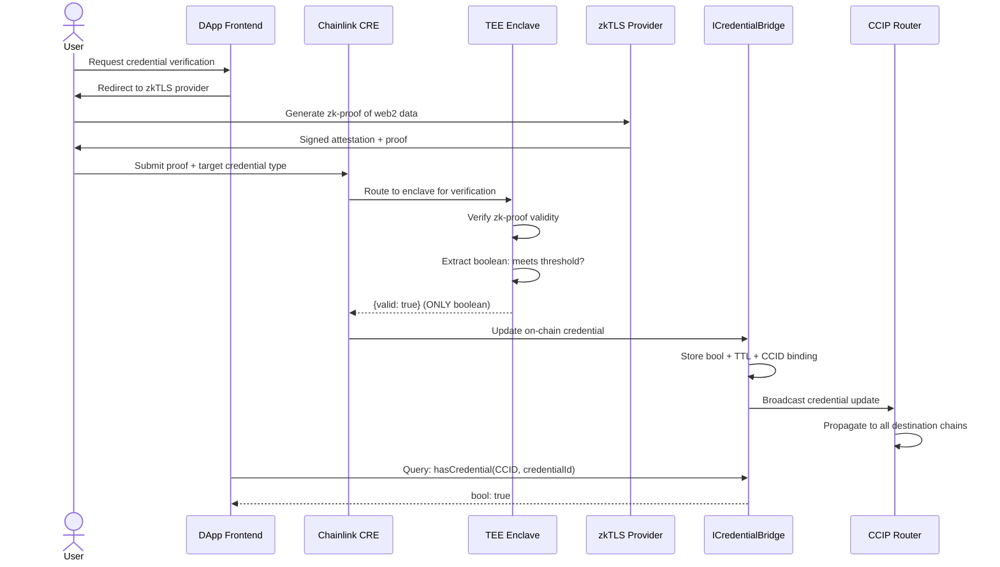

# Identity Bridge zkTLS

[](https://soliditylang.org)
[](https://book.getfoundry.sh/)
[](./LICENSE)
[](https://chain.link)
[](https://chain.link/cross-chain)
[](https://github.com/nousresearch/identity-bridge-zktls)

> **Privacy-preserving credential bridge: prove web2 attributes on-chain without exposing the underlying data.** Prove 100+ GitHub stars without revealing your username. Prove KYC completion at Binance without exposing your passport. Prove employment at a Fortune 500 company without linking your LinkedIn.

---

## Table of Contents

- [Overview](#overview)
- [Architecture](#architecture)
- [Quickstart](#quickstart)
- [Tech Stack](#tech-stack)
- [Key Features](#key-features)
- [Security](#security)
- [Deployed Addresses](#deployed-addresses)
- [zkTLS Provider Adapters](#zktls-provider-adapters)
- [Development](#development)
- [License](#license)

---

## Overview

Identity Bridge zkTLS is a **Chainlink-native, cross-chain credential bridge** that converts web2 identity data into privacy-preserving, on-chain verifiable credentials. Users authenticate against any web2 data source via zkTLS (zero-knowledge Transport Layer Security) proofs, and the only information that leaves the Chainlink Confidential Compute TEE enclave is a **boolean result** — yes or no — confirming whether the credential is valid. No raw data, no PII, no intermediate values.

Credentials are bound to a **Cross-Chain Identity (CCID)** issued through Chainlink ACE (Access Control Engine), making them portable across every chain connected via CCIP. Smart contracts query `ICredentialBridge` to ask a single question: "Does CCID `0xabc...` hold credential `GitHubStars(100+)`?" and receive a boolean answer.

### Why This Exists

The web2 identity verification market is a $490M+ ecosystem fragmented across 300+ data providers and siloed authentication services. DeFi protocols need identity verification for undercollateralized lending and RWA compliance, but traditional KYC/AML providers leak sensitive user data onto public ledgers. zkTLS solves the cryptographic problem of proving web2 data without disclosure, but every zkTLS provider (Reclaim Protocol, TLSNotary, NexaID, github-zktls) has its own SDK, its own verification logic, and its own on-chain contracts.

**Identity Bridge zkTLS unifies them all** into a single, Chainlink-orchestrated interface with TEE-backed privacy guarantees and native cross-chain credential propagation.

---

## Architecture

```
┌──────────────────────────────────────────────────────────────────────┐
│                          DAPP / SMART CONTRACT                        │
│  "Does CCID 0xabc... hold credential GitHubStars(100+)?"             │
└──────────────────────────────┬───────────────────────────────────────┘
                               │ view function call
                               ▼
┌──────────────────────────────────────────────────────────────────────┐
│                     ICredentialBridge (On-Chain)                       │
│                                                                       │
│  ┌─────────────────┐  ┌──────────────────┐  ┌─────────────────────┐  │
│  │ CredentialRegistry│  │  CCID Resolver   │  │  PolicyManager      │  │
│  │ (bool storage)   │  │  (ACE Binding)   │  │  (ACE Gate checks)  │  │
│  └────────┬────────┘  └────────┬─────────┘  └──────────┬──────────┘  │
└───────────┼────────────────────┼───────────────────────┼─────────────┘
            │                    │                       │
     ┌──────┴──────┐    ┌───────┴──────┐       ┌───────┴──────┐
     │   Ethereum   │    │   Arbitrum   │       │   Polygon    │  ← CCIP
     └─────────────┘    └──────────────┘       └──────────────┘
            │                    │                       │
            └────────────────────┼───────────────────────┘
                                 │
                    Chainlink CRE Off-Chain
                                 │
            ┌────────────────────┴────────────────────┐
            │          CRE Gateway (v1.18.0)            │
            │      Workflow Orchestration Engine        │
            └────────────────────┬────────────────────┘
                                 │
            ┌────────────────────┴────────────────────┐
            │       Confidential Compute TEE Enclave    │
            │                                          │
            │  ┌─────────────────────────────────┐    │
            │  │  zkTLS Provider Adapter Registry │    │
            │  │                                  │    │
            │  │  ┌──────────┐  ┌───────────┐    │    │
            │  │  │ Reclaim   │  │ TLSNotary │    │    │
            │  │  │ Protocol  │  │           │    │    │
            │  │  └──────────┘  └───────────┘    │    │
            │  │  ┌──────────┐  ┌───────────┐    │    │
            │  │  │  NexaID   │  │  Custom   │    │    │
            │  │  │           │  │  Providers│    │    │
            │  │  └──────────┘  └───────────┘    │    │
            │  └─────────────────────────────────┘    │
            │                                          │
            │  ONLY BOOLEAN RESULT EXITS ENCLAVE       │
            │  ┌─────────────────────────────────┐    │
            │  │ Gateway Response:                │    │
            │  │ { credentialHash, valid: true }  │    │
            │  │ AES-256-GCM encrypted            │    │
            │  └─────────────────────────────────┘    │
            └────────────────────┬────────────────────┘
                                 │
                                 ▼
            ┌─────────────────────────────────────────┐
            │         On-Chain Credential Update       │
            │   CredentialRegistry[credentialHash]     │
            │   = true (with TTL block timestamp)      │
            └────────────────────┬────────────────────┘
                                 │
                                 ▼
            ┌─────────────────────────────────────────┐
            │      CCIP Cross-Chain Broadcast          │
            │   Propagate credential to all chains     │
            │   (Arbitrum, Polygon, Base, OP, etc.)    │
            └─────────────────────────────────────────┘
```

### Data Flow (End-to-End)



---

## Quickstart

### Prerequisites

- [Foundry](https://book.getfoundry.sh/getting-started/installation) (forge, cast, anvil)
- [Node.js](https://nodejs.org/) >= 20 LTS
- [Docker](https://docs.docker.com/get-docker/) (for local TEE simulation)
- [Chainlink CLI](https://docs.chain.link/cre/cli) (CRE workflow development)

### Clone & Build

```bash
git clone https://github.com/nousresearch/identity-bridge-zktls.git
cd identity-bridge-zktls
forge install
forge build
```

### Run Tests

```bash
# Full test suite with gas report
forge test --gas-report -vvv

# Run fuzz tests only
forge test --match-contract Fuzz -vvv

# Run invariant tests
forge test --match-contract Invariant -vvv

# Coverage report
forge coverage --report lcov
```

### Local Development

```bash
# Start local chain with pre-deployed contracts
anvil --fork-url $ETH_RPC_URL

# Deploy contracts
forge script script/Deploy.s.sol:DeployIdentityBridge \
  --rpc-url http://localhost:8545 \
  --broadcast \
  --verify

# Deploy CRE workflow (TypeScript)
cd workflows/
npm install
npx chainlink-cre deploy --workflow credentialVerification.ts
```

### Query a Credential (Example)

```solidity
// SPDX-License-Identifier: MIT
pragma solidity ^0.8.30;

import {ICredentialBridge} from "identity-bridge-zktls/interfaces/ICredentialBridge.sol";

contract LendingProtocol {
    ICredentialBridge public immutable bridge;

    constructor(address _bridge) {
        bridge = ICredentialBridge(_bridge);
    }

    function canBorrow(address user) external view returns (bool) {
        bytes32 ccid = bridge.getCCID(user);
        // Require GitHub 100+ stars AND KYC verified
        return bridge.hasCredential(ccid, keccak256("GitHubStars(100+)")) &&
               bridge.hasCredential(ccid, keccak256("KYC(Binance)"));
    }
}
```

---

## Tech Stack

| Layer | Technology | Version | Purpose |
|-------|-----------|---------|---------|
| **Smart Contracts** | Solidity + Foundry | 0.8.30 / nightly | On-chain credential registry, CCID integration |
| **Upgradeability** | UUPS (OpenZeppelin) | v5.1+ | Transparent proxy pattern for contract upgrades |
| **Access Control** | AccessControl + TimelockController | OZ v5.1+ | Role-based admin with time-delayed execution |
| **Reentrancy Guard** | ReentrancyGuardTransient | OZ v5.1+ | EIP-1153 transient storage guard |
| **Oracle Orchestration** | Chainlink CRE | v1.18.0 | Off-chain workflow engine (TypeScript/Go → WASM) |
| **Privacy** | Chainlink Confidential Compute | Early Access | TEE enclave for zk-proof verification |
| **Identity** | Chainlink ACE | Beta | Cross-Chain Identity (CCID) issuance and management |
| **Cross-Chain** | Chainlink CCIP | v1.5+ | Credential broadcast across all supported chains |
| **Automation** | Chainlink Automation | v2.0+ | Credential TTL expiry and renewal triggers |
| **zkTLS Providers** | Reclaim, TLSNotary, NexaID, github-zktls | Latest | Pluggable verification adapter modules |
| **SDK** | TypeScript, Go | — | Developer SDK for credential integration |
| **Security** | Slither + Aderyn | latest | Static analysis in CI pipeline |
| **Bug Bounty** | Immunefi | — | $50K+ critical reward |

---

## Key Features

### Privacy by Architecture

All zk-proof verification occurs inside a **Chainlink Confidential Compute TEE enclave**. The enclave receives the proof data, verifies it against the target provider's attestation, evaluates the boolean condition, and outputs **only a boolean**. No raw identity data, no intermediate values, no PII ever leaves the enclave. The response is encrypted with AES-256-GCM.

### Pluggable zkTLS Provider Adapters

The system implements the `IZkTLSProvider` interface as a provider-agnostic adapter layer. Each zkTLS provider (Reclaim Protocol, TLSNotary, NexaID, github-zktls, or custom) implements a standardized adapter:

```solidity
interface IZkTLSProvider {
    function verifyProof(
        bytes calldata proof,
        bytes32 credentialType,
        uint256 threshold
    ) external returns (bool valid, bytes memory attestationId);

    function providerIdentifier() external pure returns (bytes32);
    function supportedCredentialTypes() external view returns (bytes32[] memory);
}
```

New providers can be added without modifying core contracts.

### Universal CCID Identity

Credentials are bound to a **Chainlink ACE CCID** (Cross-Chain Identity), not to a wallet address. This means:

- Users maintain one identity across all chains
- Credentials follow the user, not the address
- ACE `PolicyManager` enforces credential-gated access policies
- `IdentityManager` handles CCID issuance, recovery, and revocation

### Cross-Chain Credential Propagation

Once a credential is verified, CCIP broadcasts it to all supported chains. A `CredentialRegistry` on each chain stores the boolean + TTL. Queries are local (no cross-chain latency for reads), and the CCIP bridge ensures eventual consistency.

### Credential TTL and Auto-Expiry

Every credential has a configurable Time-To-Live (TTL). Chainlink Automation monitors credential expiry and triggers renewal workflows. Expired credentials revert to `false` automatically. Default TTLs:

| Credential Type | Default TTL | Renewal |
|-----------------|-------------|---------|
| `KYC(Provider)` | 90 days | Re-verify identity |
| `GitHubStars(N+)` | 30 days | Re-prove star count |
| `Employment(Company)` | 180 days | Re-verify employment |
| `Custom` | Configurable | Provider-defined |

### Developer SDK

TypeScript and Go SDKs provide simple integration:

```typescript
import { IdentityBridge } from '@identity-bridge/sdk';

const bridge = new IdentityBridge({ provider, chainId: 1 });

// Request a credential
const { ccid, credentialHash } = await bridge.requestCredential({
  type: 'GitHubStars',
  threshold: 100,
  provider: 'reclaim',
});

// Query credential status
const hasCred = await bridge.hasCredential(ccid, credentialHash);
console.log(hasCred); // true | false
```

---

## Security

### TEE Privacy Model

- **Enclave Isolation**: All zk-proof verification runs inside an Intel SGX / AMD SEV TEE enclave. The enclave's memory is encrypted and inaccessible to the host OS, hypervisor, and DON operators.
- **Boolean-Only Output**: The enclave is programmatically constrained to output only `{credentialHash, valid: bool}`. No raw data, no PII, no attestation contents exit the enclave.
- **AES-256-GCM Encryption**: Responses from the enclave are encrypted with AES-256-GCM before transmission.
- **Vault DON Secrets**: CRE workflows access provider API keys and verification parameters through Chainlink Vault DON secrets, never hardcoded.

### Smart Contract Security

- **No `Ownable`**: All admin actions use `AccessControl` with granular role separation and `TimelockController` for delayed execution.
- **Multi-Sig Admin**: Admin roles are held by a Safe multi-sig wallet (minimum 3-of-5 signers).
- **CEI Pattern**: All state changes follow Checks-Effects-Interactions ordering.
- **ReentrancyGuardTransient**: Uses EIP-1153 transient storage for gas-efficient reentrancy protection.
- **OWASP SC01-SC10**: Comprehensive coverage of all OWASP Smart Contract Top 10 vulnerabilities.
- **Rate Limiting**: CCIP cross-chain messages are rate-limited per destination chain to prevent DoS.
- **`allowOutOfOrderExecution=true`**: CCIP messages allow out-of-order delivery for credential broadcasts (eventual consistency model).
- **CCIP Router Verification**: All cross-chain callbacks verify `msg.sender == ccipRouter` to prevent spoofed messages.

### Audit & Bug Bounty

- **Immunefi Bug Bounty**: Active program with **$50,000+ critical reward**
- **Slither + Aderyn in CI**: Static analysis runs on every PR
- **>=90% Test Coverage**: Unit + fuzz + invariant tests
- **Formal Verification**: Planned for credential registry invariant: "A credential cannot transition from `true` to `true` without an intervening verification"

### Invariant Statements

```
INV-001: Credential validity is monotonic within a TTL window.
        hasCredential(ccid, credHash) stays true from verification
        until (block.timestamp > expiryTime).

INV-002: Only the CCIP Router can update cross-chain credential state.
        msg.sender MUST be the configured CCIP Router address.

INV-003: Credential hash is deterministic.
        keccak256(abi.encode(credentialType, threshold, params))
        produces the same hash across all chains.

INV-004: A credential bound to CCID X cannot be transferred to CCID Y.
        The CCID-to-credential binding is immutable.

INV-005: Boolean-only exit from TEE enclave.
        The gateway response contains only {credentialHash, valid: bool}.
```

---

## Deployed Addresses

> **Note**: The project is in Active Development. Deployed addresses will be published upon audit completion and mainnet launch.

| Contract | Chain | Address | Notes |
|----------|-------|---------|-------|
| `CredentialRegistry` | Ethereum Sepolia | `TBD` | Testnet deployment |
| `CredentialRegistry` | Arbitrum Sepolia | `TBD` | Testnet deployment |
| `CredentialRegistry` | Polygon Amoy | `TBD` | Testnet deployment |
| `CredentialBridge` | Ethereum Sepolia | `TBD` | CRE gateway target |
| `CCIDResolver` | Ethereum Sepolia | `TBD` | ACE CCID integration |
| `CredentialRegistry` | Ethereum Mainnet | `TBD` | Pending audit |
| `CredentialBridge` | Ethereum Mainnet | `TBD` | Pending audit |

---

## zkTLS Provider Adapters

### Supported Providers

| Provider | Status | Credential Types | Adapter Contract |
|----------|--------|-----------------|------------------|
| [Reclaim Protocol](https://reclaimprotocol.org) | Integrated | GitHub, KYC, Employment, Custom HTTP | `ReclaimAdapter` |
| [TLSNotary](https://tlsnotary.org) | Integrated | HTTP responses, JSON paths | `TLSNotaryAdapter` |
| [NexaID](https://nexaid.io) | In Progress | KYC/KYB, AML checks | `NexaIDAdapter` |
| [github-zktls](https://github.com/nousresearch/github-zktls) | Integrated | GitHub stars, contributions, org membership | `GitHubZkTLSAdapter` |
| Custom Provider | Pluggable | Any zkTLS-provable claim | Implement `IZkTLSProvider` |

### Adding a New Provider

1. Implement `IZkTLSProvider` interface
2. Deploy adapter contract (same chain as CRE gateway)
3. Register adapter via `ProviderRegistry.registerProvider(address adapter)`
4. Write CRE workflow module in TypeScript/Go (compiled to WASM)
5. Deploy workflow to CRE gateway
6. Add provider to TEE enclave allowlist via `TimelockController` proposal

---

## Development

### Project Structure

```
identity-bridge-zktls/
├── src/                          # Solidity contracts
│   ├── CredentialRegistry.sol    # On-chain credential boolean store
│   ├── CredentialBridge.sol      # CRE gateway target + CCIP integration
│   ├── CCIDResolver.sol          # ACE CCID resolver
│   ├── ProviderRegistry.sol      # zkTLS provider adapter registry
│   ├── interfaces/
│   │   ├── ICredentialBridge.sol # Main interface for dApps
│   │   ├── IZkTLSProvider.sol    # Provider adapter interface
│   │   └── ICredentialRegistry.sol
│   └── adapters/
│       ├── ReclaimAdapter.sol
│       ├── TLSNotaryAdapter.sol
│       └── GitHubZkTLSAdapter.sol
├── test/                         # Foundry tests
│   ├── unit/
│   ├── fuzz/
│   ├── invariant/
│   └── integration/
├── script/                       # Deployment scripts
│   └── Deploy.s.sol
├── workflows/                    # Chainlink CRE workflows
│   ├── credentialVerification.ts
│   ├── crossChainPropagation.ts
│   └── credentialExpiry.ts
├── sdk/                          # Developer SDKs
│   ├── typescript/
│   └── go/
├── slither.config.json
├── aderyn.toml
├── foundry.toml
└── README.md
```

### CI/CD Pipeline

```yaml
# .github/workflows/ci.yml
jobs:
  test:
    - forge test --gas-report -vvv
    - forge coverage --report lcov (enforce >=90%)
  static-analysis:
    - slither .
    - aderyn .
  fuzz:
    - forge test --match-contract Fuzz -vvv
  invariants:
    - forge test --match-contract Invariant -vvv
```

---

## License

MIT License — see [LICENSE](./LICENSE) for full text.

---

Built with Chainlink CRE, Confidential Compute, CCIP, and ACE
Identity Bridge zkTLS — Privacy-Preserving Web2 Identity for Web3

## Roadmap

### Q3 2026 (Current — 8-Week Build)

| Week | Milestone | Deliverables |
|------|-----------|-------------|
| 1-2 | Core Contracts | `CredentialRegistry`, `CredentialBridge`, `CCIDResolver`, `ProviderRegistry` deployed to Sepolia |
| 3-4 | CRE + TEE Integration | `credentialVerification.ts` workflow, TEE enclave verification modules, end-to-end test passing |
| 5-6 | CCIP + ACE | Cross-chain credential propagation between Sepolia, Arbitrum Sepolia, and Polygon Amoy; ACE CCID binding |
| 7 | SDK + Docs | TypeScript SDK on npm, Go SDK published, developer portal live |
| 8 | Audit + Launch | External audit engaged, Immunefi bug bounty launched ($50K+), mainnet deployment |

### Post-Launch

- **Q4 2026**: Formal verification with Certora, credential aggregation, mobile SDK (React Native)
- **Q1 2027**: Zero-knowledge credential proofs, DAO-based provider governance, credential scoring engine
- **Q2 2027**: Integration with institutional KYC providers (Jumio, Onfido) via zkTLS, real-time credential streaming

## FAQ

**Q: How is this different from Worldcoin or Proof of Humanity?**

A: Identity Bridge zkTLS does not require biometric data or government ID. Users prove web2 attributes (GitHub stars, KYC at an exchange, employment) cryptographically via zkTLS without revealing the underlying data. It is credential-based, not biometric.

**Q: What happens if a zkTLS provider is compromised?**

A: The system supports multiple providers for the same credential type. Credential TTLs limit the exposure window. Governance can disable a compromised provider via `TimelockController` proposal. Circuit breaker (`PAUSER_ROLE`) can halt all new verifications instantly.

**Q: Can credentials be transferred between users?**

A: No. Credentials are immutably bound to a CCID. The CCID-to-credential binding cannot be changed. This is enforced by INV-004.

**Q: What chains are supported?**

A: At launch: Ethereum, Arbitrum, Polygon, Base, and Optimism. Additional chains can be added by deploying `CredentialRegistry` + `CredentialBridge` and configuring a CCIP lane.

**Q: How much does a verification cost?**

A: Users pay gas for the on-chain transaction (~$2-10 on Ethereum L1, <$1 on L2s). There are no protocol fees. zkTLS providers may charge their own fees (typically $0.10-1.00 per verification), which are paid directly to the provider.

**Q: Is this GDPR compliant?**

A: The boolean-only architecture ensures no personal data is stored on-chain. Credential expiry and user-initiated revocation (FR-010) align with GDPR Article 17 (Right to Erasure). However, formal GDPR compliance assessment is recommended for production deployments involving EU data subjects.

## Contributing

We welcome contributions! Please see [CONTRIBUTING.md](./CONTRIBUTING.md) for guidelines. All code must pass:

- `forge test` with >=90% coverage
- `slither .` with zero high/medium findings
- `aderyn .` with zero high/medium findings
- Manual review by at least one core maintainer

Bug reports are eligible for the Immunefi bug bounty program ($50K+ critical reward).

## Acknowledgements

Identity Bridge zkTLS is built on the shoulders of the Chainlink ecosystem and the open-source zkTLS community. Special thanks to:

- **Chainlink Labs** — CRE, CCIP, ACE, Confidential Compute, and Automation infrastructure
- **Reclaim Protocol** — Pioneering zkTLS for web2 identity verification
- **TLSNotary** — Open-source TLS oracle protocol
- **OpenZeppelin** — Industry-standard smart contract libraries

---

<p align="center">
  <b>Built with Chainlink CRE, Confidential Compute, CCIP, and ACE</b><br/>
  <sub>Identity Bridge zkTLS — Privacy-Preserving Web2 Identity for Web3</sub>
</p>
